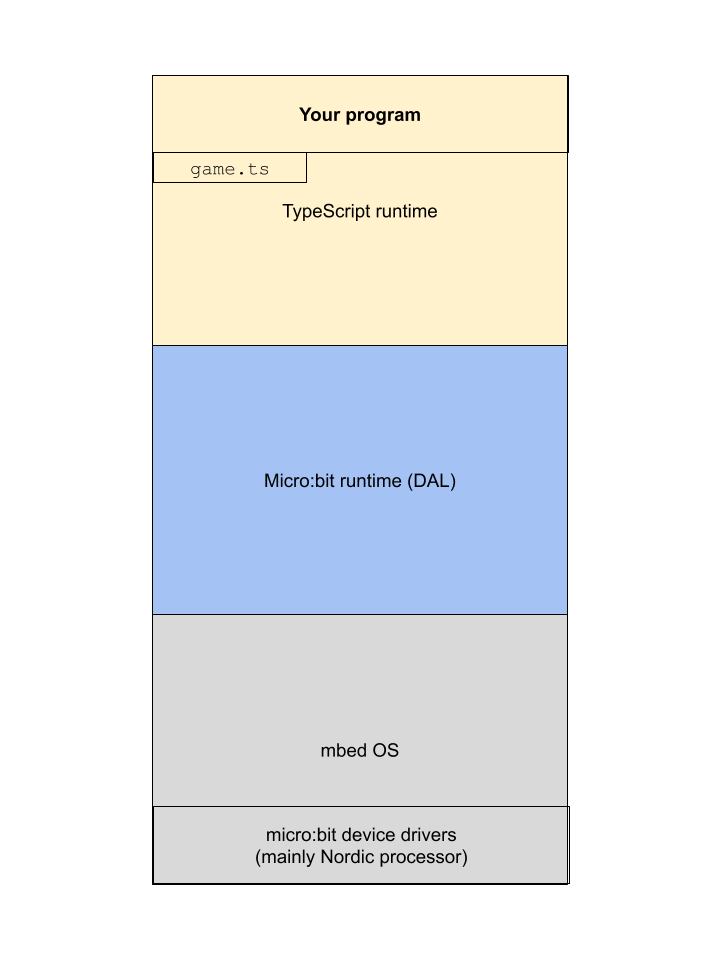
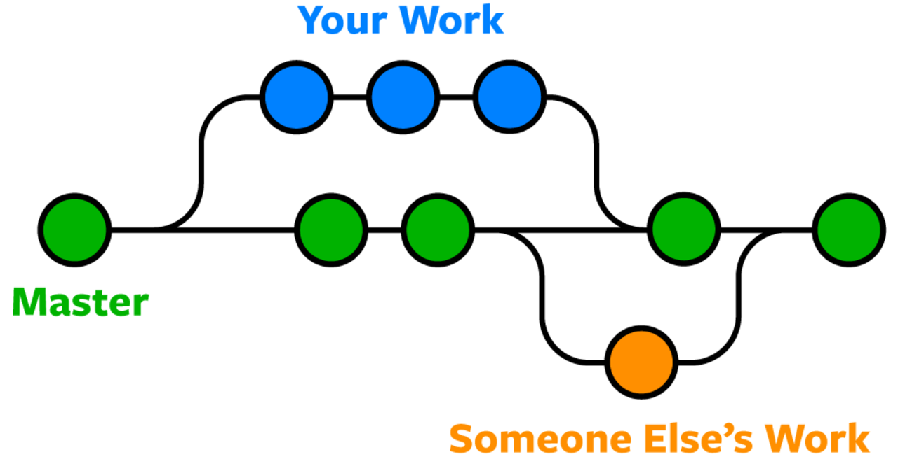
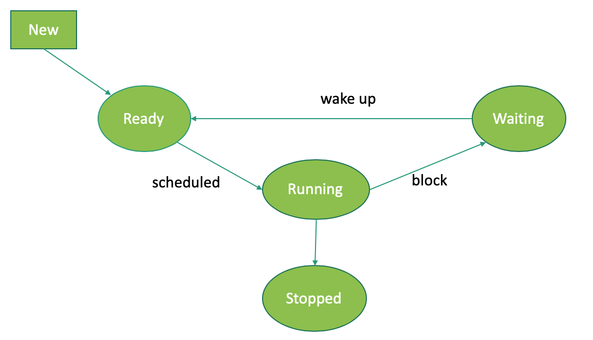

# CPE 1040 - Fall 2020

This is learning progression 003 for the Fall 2020 installment of the course CPE 1040: Introduction to Computer Engineering at MSU Denver.

Table of Contents
=================

* [CPE 1040 \- Fall 2020](#cpe-1040---fall-2020)
  * [Learning Progression 003: Screensavers (Part 3)](#learning-progression-003-screensavers-part-3)
    * [9\. Code reading](#9-code-reading)
      * [1\. Study](#1-study)
        * [game\.ts](#gamets)
        * [enum types](#enum-types)
        * [Namespace game](#namespace-game)
        * [Exported functions](#exported-functions)
        * [Class LedSprite](#class-ledsprite)
      * [2\. Apply](#2-apply)
      * [3\. Present](#3-present)
    * [10\. Iterative development with Github](#10-iterative-development-with-github)
      * [1\. Study](#1-study-1)
        * [Git command line](#git-command-line)
        * [Git remote and local](#git-remote-and-local)
        * [Git commands](#git-commands)
        * [Git branch and merge](#git-branch-and-merge)
        * [Github workflow](#github-workflow)
        * [Incremental development](#incremental-development)
      * [2\. Apply](#2-apply-1)
      * [3\. Present](#3-present-1)
    * [11\. Reactive system](#11-reactive-system)
      * [1\. Study](#1-study-2)
        * [Software stack](#software-stack)
        * [Fiber scheduling](#fiber-scheduling)
        * [Events revisited](#events-revisited)
        * [forever vs while](#forever-vs-while)
      * [2\. Apply](#2-apply-2)
      * [3\. Present](#3-present-2)
    * [12\. Matrix dynamics](#12-matrix-dynamics)
      * [1\. Study](#1-study-3)
        * [Out\-of\-bound coordinates](#out-of-bound-coordinates)
        * [Smooth graphics](#smooth-graphics)
        * [Speed and scheduling](#speed-and-scheduling)
        * [Mod\-based timing](#mod-based-timing)
        * [Frame\-based display](#frame-based-display)
        * [Simulator fidelity revisited](#simulator-fidelity-revisited)
      * [2\. Apply](#2-apply-3)
      * [3\. Present](#3-present-3)


## Learning Progression 003: Screensavers (Part 3)
[[toc](#table-of-contents)]

This progression is the culmination of the first part of the course, in which we program the bear-bones micro:bit without any extenral circuitry attached and without communication features. We pull together all the programming language features and best practices that we introduced in the previous two learning progressions, to write a significantly larger target program over 12 steps. This will present the opportunity to learn about some of the design considerations a programmer makes when approaching a larger project. The progression is also going to dig a bit deeper into the _softare stack_ of the micro:bit, and uncover the ways it affects these considerations.
   
### 9. Code reading
[[toc](#table-of-contents)]

#### 1. Study
[[toc](#table-of-contents)]

##### game.ts

`[<lernact-rd>]`Being able to read programming code written by others is almost as important a skill as being able to write it yourself. This skill is called upon much more frequently than a novice programmer might expect. Large programming projects are highly collaborative undertakings and reading each other's code is one of the main activities of the project members.

Having the micro:bit as our model computer and MakeCode as our programming environment and editor, we will take [`game.ts`](https://github.com/microsoft/pxt-microbit/blob/master/libs/core/game.ts), one of the `[<cept>]`_library_ files of the Microsoft PXT project, the foundation for MakeCode's support for the micro:bit, as our object of exercise in code reading. This library defines the `game` namespace, which we have used when we used the `game.LedSprite` class in some programming tasks.

A library is a self-contained collection of programming artifacts, in particular `[<cept>]`_type definitions_, `[<cept>]`_functions_, and `[<cept>]`_classes_, generally of a common theme. A library has no `[<cept>]`_main program_, but instead is used as an already prepared resource in writing a main program. A libary exports (some of) its programming artifacts to be used in writing other libraries or standalone programs.

The way MakeCode exposes libraries like [`game.ts`](https://github.com/microsoft/pxt-microbit/blob/master/libs/core/game.ts) is by compiling all of them together in the TypeScript `[<cept>]`_runtime_. The TS runtime is a top layer of the micro:bit `[<cept>]`_software stack_. (If we instead wrote our programs in MicroPython, its runtime would be the top layer of the stack.) A runtime is a set of programs which translates human-readable programs in a particular programming language into one lower layer of the software stack, the code in which is usually much similar to the physical operation of the physical device that will run the programs. For example, in the case of the micro:bit, the layer below the TS runtime is the [micro:bit runtime](https://tech.microbit.org/software/runtime-mbed/), which abstracts the low-level functionality of the physical device into generic-device programming artifacts. For this reason, it is also called a `[<cept>]`_device abstraction layer_ (DAL). See the diagram showing the software stack of the micro:bit when we use TS to program it: 



The TS runtime is used in the in-browser MakeCode editor and simulator, but is also inserted as part of the generated HEX file that is written to the micro:bit device. You may notice that the comments above the programming artifacts included in the [`game.ts`](https://github.com/microsoft/pxt-microbit/blob/master/libs/core/game.ts) library are highly structured and look like code themselves. These are called `[<cept>]`_annotations_ and are used for various purposes, including presentation, linking in a programming environment, documentation generation, etc. The MakeCode editor, which presents artifacts in both Blocks and TS, these annotations are an inseparable part of creating such a straightforward programming environment. 

When we said that the [`game.ts`](https://github.com/microsoft/pxt-microbit/blob/master/libs/core/game.ts) library is self-contained, this was meant to indicate that it defines the game package in its entirety. That is, there aren't two different libraries that have to be used in tandem to create a game for the micro:bit. This said, the library itself depends on artifacts defined in other libraries.

##### enum types

The [`game.ts`](https://github.com/microsoft/pxt-microbit/blob/master/libs/core/game.ts) library defines two enumerated (that is, `enum`) types:
1. `Direction` is used to simplify the manipulation of the `LedSprite` motion.    
2. `LedSpriteProperty` exposes 5 different "properties" of the `LedSprite`, creating a common mechanism for their retrieval and manipulation (aka getting and setting), as shown in the next example:
```javascript
// Example 9.1.1

let sprite : game.LedSprite = game.createSprite(4, 0)

let b : number = sprite.get(LedSpriteProperty.Brightness)  

sprite.set(LedSpriteProperty.Brightness, b/2)
```

An enumerated type is a programming artifact which has attributes of arrays and classes at the same time, though it is neither. It is multi-valued like an array, and it defines a type like a class. It is an ordered collection of names, which in themselves correspond to integers. All names can have their numeric value assigned explicitly, or they take the incremented value of the previous name in the collection:
```javascript
// Example 9.1.2

enum CommodityValue { Iron = 100, Silver = 250, Gold = 350 }
enum Bird { Sparrow = 0, Hawk, Eagle, Finch, Osprey, Canary }  // e.g. Bird.Finch equals 3
```

Notice that the two enumerated types are defined _outside_ the namespace `game`. Thus, they can be used freely for purposes other than the ones which define a game environment. It is conventional to put types in the top-level scope of a program (or, in this case, library).

##### Namespace `game`

A namespace is a named scope (aka block):
```javascript
// Example 9.1.3

namespace screensaver { }
```
It is just a way to enclose a set of tightly related programming artifacts together. Those of the artifacts that are expected to be called from outside the scope are `[<cept>]`_exported_ via the keyword `export` put in front of the artifact signature. The `game` namespace exports game-related functions (e.g. `createSprite`) and the class `LedSprite`. As we have seen, this means we have to use the namespace name as a `[<cept>]`_prefix_ to the function and class names:
```javascript
// Example 9.1.4

let s : game.LedSprite = game.createSprite(2, 1)
```

The scope that a namespace provides is ideal for defining namespace-global variables for the specific purpose of the namespace (in our case, a micro:bit game) without contaminating the top-level program scope with them. The following example lists all the variables used in a game, which are nonetheless not directly visible to the programmer using the `game` package in MakeCode:
```javascript
// Example 9.1.4

namespace game {
    let _score: number = 0;
    let _life: number = 3;
    let _startTime: number = 0;
    let _endTime: number = 0;
    let _isGameOver: boolean = false;
    let _countdownPause: number = 0;
    let _level: number = 1;
    let _gameId: number = 0;
    let _img: Image;
    let _sprites: LedSprite[];
    let _paused: boolean = false;
    let _backgroundAnimation = false; // indicates if an auxiliary animation (and fiber) is already running
    
    // rest of the namespace
}
```
Reading through the namespace code, we see that these are the variables used internally by the functions in the namespace. Notice that the names all start with an _underscore_ (e.g. `_score`, _gameId_, etc.). This is a convention in programming for _internal_ variables that are not exposed and/or exported.

##### Exported functions

The functions declared in the `game` have to do with game-related functionality (e.g. `addScore`, `startCountdown`, `gameOver`, etc.). Most of them are exported and are meant to be used together. Most of the function names are self-explanatory, but, if in doubt, read the [reference](https://makecode.microbit.org/reference/game) for `game`.

Not all of the artifacts declared in the namespace need be exported. For example, the functions `checkStart`, `unplugEvents`, `init`, and `plot` are not exported, but are only used internally by exported functions.

##### Class `LedSprite`

We have already used the class `game.LedSprite`, for example, in `HaloSprite` where we `[<cept>]`_extended_ the base `game.LedSprite` class to add a halo around a bouncing sprite. One implementation of the `Raindrop` class can also use `game.LedSprite` as a `[<cept>]`_base class_. One obstacle for using it for all the screensavers is that every `game.LedSprite` is managed by the machinery of the `game` namespace, which has its own constraints and proper intended uses. For example, to remove a `game.Sprite` completely, one needs to explicitly call `delete()` on a sprite. Also, `game.LedSprite` objects do not accept out-of-bound coordinate values.

`game.LedSprite` is built on top of the much simpler functionality of turning LEDs on and off, and varying their brightness. For some of our screensavers, using `game.LedSprite` may make the implementation unnecessarily burdensome, because, like every data type defined by a class, there is a specific intended manner of manipulating objects of the type. For example, creating a new class `Raindrop` without extending `game.LedSprite` results in a much cleaner and shorter implementation.


#### 2. Apply
[[toc](#table-of-contents)]

1. `[<lernact-prac>]`Organize your `screensaver` namespace like the [`game.ts` library](https://github.com/microsoft/pxt-microbit/blob/master/libs/core/game.ts). Write the _main program_ at the very bottom, using the exported functions. _Do you have types outside the namespace? Do you need to export any classes?_   
2. `[<lernact-prac>]`For each global variable, function, and class method in the namespace `screensaver`, write a descriptive comment, on the side of the variables and on top for the functions/methods. Remember the _last repository commit_ that you made completing these tasks.    

#### 3. Present
[[toc](#table-of-contents)]

In the [programs](programs) directory:
1. Add your program from 9.2.1 with filename `microbit-program-9-2-1.js`.  
2. Add your program from 9.2.2 with filename `microbit-program-9-2-2.js`.  

In the [Lab Notebook](README.md):
1. Answer the questions in 9.2.1.  
2. Link to the program from 9.2.1.  
3. Link to a demo video showing the execution of the program from 9.2.1. This is needed as a verification that you haven't broken your code.  
4. Link to the program from 9.2.2.  
5. Link to a demo video showing the execution of the program from 9.2.2. This is needed as a verification that you haven't broken your code.  

   
### 10. Iterative development with Github  
[[toc](#table-of-contents)]

#### 1. Study
[[toc](#table-of-contents)]

##### Git command line

`[<lernact-rd>]`Github is built around the `[<cept>]`_version-control system_ [Git](https://git-scm.com/) (aka `[<cept>]`_source-control management_ system). The term "source" is used for the raw human-readable form of a program, to be contrasted against the machine-executable form of the program. Nowadays, no programming or engineering project is undertaken without keeping a dynamic record of all the changes made. As a large project does not happen overnight, this record is indispensable. It is the central component of modern engineering workflows, supporting a large range of team organizations, company policies, development use cases, and release schedules.  

One of the first large `[<cept>]`_open-source_ projects, and still one of the most popular, is the [Linux kernel](https://en.wikipedia.org/wiki/Linux_kernel), which is the basis for all Linux-based `[<cept>]`_operating systems_. Git was [developed](https://git-scm.com/book/en/v2/Getting-Started-A-Short-History-of-Git) to coordinate its highly-distributed multi-person development. Just take a look at the number of commits to Linus Torvalds' [Linux kernel repository on Github](https://github.com/torvalds/linux) to get an idea of the scope of the project and the complexity of its maintenance.

We are already working with Git. You are reading a Markdown file in a _private_ Github repostory which is owned by the course staff and was created specifically for you. You have been added as an `[<cept>]`_outside collaborator_ and given full member access to the repository. You and the course staff can create files, modify files, and make comments.

##### Git remote and local

Working directly with the Github website, we are using Git only _indirectly_, because all Git operations are handled for us by Github. To learn Git, we need to take our code out of Github and look at the underlying Git operations performed on it in a _local_ `[<cept>]`_clone_ of the repository.

This step asks you to install the `[<cept>]`_command-line_ [Git client](https://git-scm.com/), a program which can work with _remote_ servers where Git repositories are maintained. Github is the largest such server. 

`[<lernact-see>]`Git was meant to be a distributed source control system so it was designed with the notion of `[<cept>]`_remote_ and `[<cept>]`_local_ repositories. In our case, the remote repositories are on Github, and the local are copies of the remote ones on our own computers. There are three scenarios of remote-local work we will cover:
1. **Scenario 1: Github only**. It is explained and shown in this [demo video](https://msudenver.yuja.com/V/Video?v=1991009&node=7634464&a=961358564&autoplay=1).   
2. **Scenario 2: Github and local**. It is explained and shown in this [demo video](https://msudenver.yuja.com/V/Video?v=1991697&node=7636328&a=1013082438&autoplay=1).    

  

[[Image credit](https://dev.to/mollynem/git-github--workflow-fundamentals-5496)]

3. **Scenario 3: Local to Github**. It is explained and shown in this [demo video](https://msudenver.yuja.com/V/Video?v=1992746&node=7638785&a=1457131414&autoplay=1).   

##### Git commands

Follow a quick review of the most fundamental Git commands, with links to the documentation:
1. [`git init`](https://git-scm.com/docs/git-init): Creates an empty local Git repsitory. Usually the first command when starting from local.    
2. [`git clone`](https://git-scm.com/docs/git-clone): Clones a repository into a new directory. This is what we use to make a local copy of a repository already existing on Github.     
3. [`git remote`](https://git-scm.com/docs/git-remote): Manage a set of tracked repositories. In particular, can point a local repository to its remote counterpart. It has many options.    
4. [`git status`](https://git-scm.com/docs/git-status): Reports the status of the working tree. In particular, reports modifications of tracked files and newly created untracked files.  
5. [`git add`](https://git-scm.com/docs/git-add): Add file(s) to tracking `[<cept>]`_index_. In other words, this includes a file(s) to version control.     
6. [`git commit`](https://git-scm.com/docs/git-commit): Record changes to a repository. It requires a commit message (with option `-m`), which should be a short informative summary of what changed since last commit.     
7. [`git pull`](https://git-scm.com/docs/git-pull): Fetch and sync with another repository, usually a remote. Used to sync a local repository with its Github remote if the latter changed.    
8. [`git push`](https://git-scm.com/docs/git-push): Update remote repository. Local commits need to be pushed to be refleced in the remote repository (e.g. on Github).    
9. [`git mv`](https://git-scm.com/docs/git-mv): Move or rename a file/directory. Updates the index!  
10. [`git rm`](https://git-scm.com/docs/git-mv): Remove a file/directory. Updates the index!  

##### Git branch and merge

In the image in [Git remote and local](#git-remote-and-local) section image, we saw the command `checkout` but we didn't explain it. One of the most important features of Git is that it allows a team to isolate the development of new features from the main project until they are sufficiently mature. This is achieved by `[<cept>]`_branching_ off the main project (aka master), which can be thought as the `[<cept>]`_trunk_. Branching (aka **Fork** in Github), is essentially a copy of the repository under a new name, which however is still tracked in parallel with the trunk. At some point in the future, the branch developers may request that their code is `[<cept>]`_merged_ into the trunk. Merge is done when the branch code is sufficiently mature and may require several iterations to be brought into consistence with the trunk, which may also have changed and/or been merged with other branches. This is illustrated in the following simple diagram:



[[Image credit](https://www.nobledesktop.com/learn/git/git-branches)]

The most relevant Git commands which support branching and merging are:
1. [`git branch`](https://git-scm.com/docs/git-branch): Manipulate branches.    
2. [`git checkout`](https://git-scm.com/docs/git-checkout): Switch branches. Updates the working tree.    
3. [`git switch`](https://git-scm.com/docs/git-switch): Switch branches.    
4. [`git merge`](https://git-scm.com/docs/git-merge): Join two or more development histories together.    
5. [`git tag`](https://git-scm.com/docs/git-tag): Manipulate tags. Tags are names for particular points in the development history of a project branch. They are used to indicate that a major feature is completed, a significant rework has been completed, an early release is ready for testing, etc. See an example of a [Git tag](https://github.com/ivogeorg/ce-learning-progression-002-bouncing-sprites/releases/tag/v1.0) on a Github repository. Github creates code packages and some additional features around tags and calls this extended feature `[<cept>]`_Releases_. This is a common term in software development, and you have experienced it at least once when, for example, your computer or phone operating system updated to a new version.    
6. [`git log`](https://git-scm.com/docs/git-log): Shows commit logs. On Github, this is done by clicking on **Commits**.    


[[Image credit](https://leanpub.com/git-flow/read)]

##### Github workflow

Github follows the main contours of the Git workflow, but adds various features on top, among them:
1. Defines organizations, teams, and projects, with all the necessary management and logistics around them.  
2. It adds various collaboration tools and workflow details that don't exist in raw Git.  
3. It adds `[<cept>]`_pull requests_, which is a feature related to team organization, in which only some team members (called `[<cept>]`_committers_) are allowed to commit to the trunk, while others can only request that their changes are pulled in by the committers.  
   - [Github Classroom](https://classroom.github.com/classrooms) currently piggy-backs on top of pull requests for the **Feedback** feature.  
4. It adds comments at many places in the workflow.  
5. It maintains the `README.md` convention.  
6. Defines releases.  

##### Incremental development

`[<lernact-rd>]``[<cept>]`_Incremental development_ means a sequence of programming iterations which:
1. Make a small but sufficient (that is, incremental) addition to the current program, be it a new feature, a modification of its functionality or user interface, a bug fix, etc.  
2. Runs, tests, and `[<cept>]`_debugs_ the additions, until no more bugs can be identified. This should include testing older code, to ensure that the new additions have not introduced bugs into the old code. This is called `[<cept>]`_regression testing_.      
3. Commits the changes. If a significant new functionality has been accumulated, all the outstanding local commits are pushed to the remote repository.    

`[<lernact-see>]`Watch the following recordings of two live coding sessions where incremental development was shown in the context of creating two new classes in JavaScript:
1. `class Complex` [video](https://msudenver.yuja.com/V/Video?v=1978529&node=7604592&a=1823805177&autoplay=1) and [source code](https://gist.github.com/ivogeorg/842c36004e50143b43c6affd0dfa7984).    
2. `class UnsignedBinary` [video](https://msudenver.yuja.com/V/Video?v=1978655&node=7604844&a=1873218802&autoplay=1) and [source code](https://gist.github.com/ivogeorg/ef5f46b8ca67cfa5cdf9c8cbd217c9ef).   

#### 2. Apply
[[toc](#table-of-contents)]

1. `[<lernact-prac>]`Clone your remote assignment repository to your local environment. In the local directory, create an initally empty documentation directory called `docs`, commit, and push to remote.  
2. `[<lernact-prac>]`Start a new local repository. Create a `.txt` and `.js` file in it. Add and commit. On github create a new empty repository called `remote-home-for-local`. Link the local with the remote and push the contents.    
3. `[<lernact-prac>]`Tag the last commit from 9.3.1 as `v0.8`. _Note: It should include your latest commits of the Lab Notebook._   
4. `[<lernact-prac>]`Tag the last commit from 9.3.1 as `v0.9`. _Note: It should include your latest commits of the Lab Notebook._   
5. `[<lernact-prac>]`Create a file `screensavers.js` from the `v0.9` program. Tag as `v1.0`.  

#### 3. Present
[[toc](#table-of-contents)]
   
In the [programs](programs) directory:
1. Add your program from 10.2.5 with filename `screensavers.js`.  

In the [Lab Notebook](README.md):
1. Link to the `docs` directory created in 10.2.1.  
2. Link to the repository created in 10.2.2.  
3. Link to the `v0.8` tag.  
4. Link to the `v0.9` tag.  
5. Link to the `v1.0` tag.  


### 11. Reactive system  
[[toc](#table-of-contents)]

#### 1. Study
[[toc](#table-of-contents)]

##### Software stack

`[<lernact-rd>]`As we have mentioned already, the software that runs (on) the micro:bit is not `[<cept>]`_monolithic_, but layered, with the layers forming a `[<cept>]`_stack_, which we call `[<cept>]`_software stack_. A stack is such a structure, data or physical, in which every element (layer) isolates completely the elements above and below it. In software engineering, that is, writing large system programs, such an organization follows the important designs principle of `[<cept>]`_uncoupling_ (keeping apart components which should be separate) and `[<cept>]`_abstraction_ (performing increasingly integrated operations at each higher layer).

The software stack of the micro:bit consists of 3 main layers (see the [diagram](#gamets) in an earlier step):
1. TypeScript [runtime](https://en.wikipedia.org/wiki/Runtime_system). This is the highest-abstraction layer and is responsible for translating the TS program into computational artifacts that can be handled by the micro:bit device, among those:    
   - arrays  
   - classes & objects, including:  
     - `[<cept>]`_virtual tables_ for `[<cept>]`_polymorphic methods_  
     - memory management  
   - functions  
   You can read about these and more in the [Static TypeScript paper](https://www.microsoft.com/en-us/research/uploads/prod/2019/09/static-typescript-draft2.pdf) which describes the implementation of the [subset of TypeScript implemented for the MakeCode environment](https://makecode.com/language) in detail.      
2. [micro:bit runtime](https://lancaster-university.github.io/microbit-docs/). This is the middle layer and is responsible for exposing various computational capabilities of the micro:bit to a programming language runtime for TypeScript, [MakeCode Python](https://support.microbit.org/support/solutions/articles/19000111744-makecode-python-and-micropython), or [MicroPython](https://microbit-micropython.readthedocs.io/en/v1.0.1/). Among the exposed capabilities are: 
   - scheduling  
   - device `[<cept>]`_drivers_ (small programs specifically focused on running a sensor, an actuator, or other device)      
   - the 5x5 LED matrix  
3. [Mbed](https://os.mbed.com/) `[<cept>]`_operating system_. This is the lowest level and is responsible for overall management of the computational resources of the micro:bit device, including:  
   - security foundations  
   - cloud management services  
   - drivers for sensors, I/O devices, and networking    
   - hardware abstraction layer (HAL) (the HAL is an instance of _uncoupling_ and _abstraction_, allowing the same general functionality to run on millions of different devices)  
   An important portion of the Mbed layer is the [Nordic Semiconductor Software Development Kit](https://www.nordicsemi.com/Software-and-tools/Software/nRF5-SDK), which is a collection of programs and development tools for the most important hardware component of the micro:bit, the `[<cept>]`_application processor_. More on the [hardware stack](https://tech.microbit.org/hardware/) of the micro:bit in a later learning progression.  

The [software](https://tech.microbit.org/software/) section of the [technical documentation](https://tech.microbit.org) of the micro:bit is a good source of detail on these stack components. A full study of the software stack is beyond the scope of this learning progression, but you can read a more in-depth description in this [blog post](https://mattwarren.org/2017/11/28/Exploring-the-BBC-microbit-Software-Stack/).

##### Fiber scheduling 

One of the most important functions of a runtime or an operating-system layer of the software stack is `[<cept>]`_scheduling_, the process of arranging various program components to execute in some order. Schedulable program components are called `[<cept>]`_threads_. While several threads can be part of the same program, they can be executed independently of each other. Look at the following screenshot of a macOS Activity Monitor window:


Notice the following:
1. The first column is called **Processes** rather than programs. `[<cept>]`_Processes_ are activated executable programs. In contrast, unactivated `[<cept>]`_programs_ are just unopened files.  
2. The column **Threads** shows the number of threads being executed for each of the processes. There is no process that has only one thread!  

Threads are the units of scheduling. They have a lifecycle of several states, as shown in the following image (notice that _scheduling_ is an operation that changes the state of the thread):



[[Image credit](https://medium.com/@dreamume/kernel-thread-states-9a8c877b3fc2)]

`[<lernact-rd>]`The micro:bit reference has a page that explains [how scheduling is performed for the micro:bit](https://makecode.microbit.org/device/reactive), along with examples of handling events. _It is the most important part of reading in this learning progression as it is the first one in which we treat the micro:bit as a computer rather than an entertaining toy._

The scheduling is done in the TS runtime layer, based on a computational capability provided by the micro:bit runtime (DAL) layer. The unit of scheduling provided by the dal is called a `Fiber`, as it is a `[<cept>]`_lightweight_ (meaning providing more limited functionality) thread. The TS runtime uses in its code computational artifacts provided in the DAL. The following links give a glimpse into the code of the two layers, invloved in fiber scheduling:
1. micro:bit runtime (DAL):
   1. [`MicroBitFiber.h`](https://github.com/lancaster-university/microbit-dal/blob/master/inc/core/MicroBitFiber.h) declares the scheduling machinery that is to be exposed.  
   2. [`MicroBitFiber.cpp`](https://github.com/lancaster-university/microbit-dal/blob/master/source/core/MicroBitFiber.cpp) is the source code of the implementation.  
2. TypeScript runtime:
   1. Fiber calls in the [pxt-common-packages](https://github.com/microsoft/pxt-common-packages/search?q=fiber+in%3Atext) libraries.  
   2. Fiber calls in the [pxt-microbit](https://github.com/microsoft/pxt-microbit/search?q=fiber+in%3Atext) libraries.      

All the issues of programming with multiple threads (aka `[<cept>]`_multithreading_) are beyond the scope of this learning progression, but it is important to know that they are the main units of scheduling and execution, and thus have to do with, among others:
1. Issues of program speed.
2. Issues of memory utilization.
3. Issues of thread safety. (Usually due to `[<cept>]`_non-deterministic_ splitting & rearrangement of code portions.)  

##### Events revisited 

The [Reactive system](https://makecode.microbit.org/device/reactive) reference page gave an example of how a button press is handled. The whole process involves not only the full software stack, but the `[<cept>]`_full stack_ of the micro:bit, which includes the hardware on top of which the software stack lays. (See the diagram in the [micro:bit software-stack blog post]((https://mattwarren.org/2017/11/28/Exploring-the-BBC-microbit-Software-Stack/)). The full account of the traversal of the full stack of the reaction to an external event (e.g. button pressed, a gesture made, a signal receieved over radio or a GPIO pin), from the detection of the signal which generates a processor interrupt to the way your program is informed of the event and reacts to it, is also beyond the scope of this learning progression. We will only revisit the top layer, namely the `[<cept>]`_registrant functions_.

Examples of registrant functions are `input.onButtonPressed()`, `input.onGuesture()`, and `pins.onPulsed()`, among others. These functions register `[<cept>]`_event handlers_ by providing functions to be executed for specific events. They take as arguments the event-handler functions that we write, as in:
```javascript
// Example 11.1.1

let turn : Direction = Direction.Right

input.onButtonPressed(  Button.A,   () => { turn = Direction.Left; }  )
```
Notice the following:
1. The registrant function is `input.onButtonPressed` and is registering an event-handler for the event of button A having been pressed (note, and _released_).  
2. The two arguments of the registrant function are the name of the button from the `enum` type `Button`, and the event-handler code wrapped in an anonymous function. _Note that `() => { }` is just a lazy shortcut for `function () { }` and widely used in JavaScript._  
3. The registrant function is _in the global scope_ (meaning the top level of the program), and not enclosed in a `forever`, a function, or a class. If you have read the [Reactive system](https://makecode.microbit.org/device/reactive), you will know that **you should never have event handling in a `forever` loop** or other nested scope. First, it doesn't make sense, because the event handling mechanism has an execution protocol which is _defined sufficiently_ by a free-standing registrant function, and over which you have _no further control_. Second, it makes your program extremely hard to read. Lastly, it creates false impressions in you that you have extra control over event handling.
4. The event handling code is _minimal_. The [Reactive system](https://makecode.microbit.org/device/reactive) reference page also shows that the even handler `[<cept>]`_preempts_ (meaning it inserts inself in front of) the current fiber which is running, making its execution timing unpredictable and possibly making the display dynamics less smooth.

##### `forever` vs `while`

The `basic.forever()` function is under special management of the TypeScript runtime, but the `while () {}` loop is just a basic language component and is handled without any translation through the TR and micro:bit layers of the software stack. This results in some notable differences in the program execution behavior of the same code, passed as an anonymous function argument to a `forever` function, on one hand, and wrapped in a simple `while` loop, on the other. The following table summarizes the differences:

feature | `forever` | `while`
-- | -- | --
condition | no | yes
`break` | no | yes
scheduling | yes | no
simulator fidelity | yes | no

This is one simple example of why knowledge of the layers of a software stack are important to a computer engineer. The practice tasks below are supposed to provide some direct experience with the particular handling of `forever` loops by the TS runtime.


#### 2. Apply
[[toc](#table-of-contents)]

1. `[<lernact-prac>]`Create 6 separate `forever` loops, each one containing `showNumber()` with a different one of the numbers n = 1, 3, 5, 7, 9, 11, 13. Describe the behavior. Can you see all the numbers clearly?  
2. `[<lernact-prac>]`Modify the previous program to show the either n or n + 1 toggled by pressing button A. Describe the behavior. How soon do the numbers switch after you press the button?  
3. `[<lernact-prac>]`Modify the previous program, adding a random `pause()` between 300 and 1200 ms after `showNumber()`. Describe the behavior. Can you see the numbers out of order?   

#### 3. Present
[[toc](#table-of-contents)]
   
In the [programs](programs) directory:
1. Add your program from 11.2.1 with filename `microbit-program-11-2-1.js`.  
2. Add your program from 11.2.2 with filename `microbit-program-11-2-2.js`.  
3. Add your program from 11.2.3 with filename `microbit-program-11-2-3.js`.  

In the [Lab Notebook](README.md):
1. Link to the program from 11.2.1 and describe its behavior.  
2. Link to a demo video showing the execution of the program from 11.2.1.  
3. Link to the program from 11.2.2 and describe its behavior.  
4. Link to a demo video showing the execution of the program from 11.2.2.  
5. Link to the program from 11.2.3 and describe its behavior.  
6. Link to a demo video showing the execution of the program from 11.2.3.  


### 12. Matrix dynamics  
[[toc](#table-of-contents)]

#### 1. Study
[[toc](#table-of-contents)]

##### Out-of-bound coordinates

`[<lernact-rd>]`The screensavers program is largely meant as a culminating programming experience, but a close second reason for it is to expose the programmer to some of the manifestations of the functioning of the software stack. The most readily observable telltales are in the LED matrix dynamics of complex randomized behavior demanded by the various screensavers.

One of the easiest discernable difference between two seemingly equivalent programming expressions is that the functions `led.plot()` and `led.unplot()` accept out-of-bound coordinates, while the constructor and other methods of the `game.LedSprite` class do not. The former are `[<cept>]`_low-level functionality_, directly connected to the physical turning on and off of the LEDs, while the latter is part of the `game` namespace, itself part of the pxt platform underlying the MakeCode environment and the TS runtime, which imposes extra constraints in order to focus on the `[<cept>]`_high-level functionality_ of a micro:bit game. Here, for example, are the lines of the `game.LedSprite` constructor, which enforces one of these constraints:
```javascript
// Example 12.1.1

namespace game {

    // namespace data and functions
    
    export class LedSprite {
        private _x: number;
        private _y: number;
        private _dir: number;
        private _brightness: number;
        private _blink: number;
        private _enabled: boolean;

        constructor(x: number, y: number) {
            this._x = Math.clamp(0, 4, x);             // <-- clamp to range [0, 4]
            this._y = Math.clamp(0, 4, y);             // <-- clamp to range [0, 4]
            this._dir = 90;
            this._brightness = 255;
            this._enabled = true;
            init();
            _sprites.push(this);
            plot();
        }
    }
}
```

##### Smooth graphics

The screensaver sub-programs look the best when the graphics are smooth. One of the ways to achieve that is to refrain from using the methods in the `basic` namespace, in particular the `show...()` and `plot...()` methods as well as the `pause()`, the former because they are slow, and the latter because it adds the uncertainty about when the fiber that was put to sleep will run again. The only guarantee that `pause()` gives is that the fiber will not restart _earlier_ than the time argument in ms. So, for smooth graphics, one should try to handle most of the lighting and timing of the screensaver, even if that means letting go of the comfort and ease of the functions exported by the `basic` namespace.

One `basic` function which is relatively safe to use is `basic.clearScreen()`, because it is fast and as basic as `led.plot()` and `led.unplot()`. In fact, it is much faster than a loop to `led.unplot()` all lit-up LEDs.

##### Speed and scheduling

Using `basic.clearScreen()` may result in behavior that is both unexpected and hard to debug at first. Look at the following example:
```javascript
// Example 12.1.2

while (true) {
    if (isHeart) {                                             
        basic.showIcon(IconNames.Heart)
    } else {
        basic.showIcon(IconNames.Butterfly)
    }
    basic.pause(100)
    basic.clearScreen()
    basic.pause(100)                             // THIS IS REQUIRED TO SEE THE ICON BLINK
}
```
Because `showIcon()` is slow but `clearScreen()` is fast, the will be no detectable interval between the call to `basic.clearScreen()` and the subsequent call to `basic.showIcon()` in the loop, requiring an extra `basic.pause()` to be inserted. This may or may not affect the smoothness of a screensaver, so it pays to be aware of it.

##### Mod-based timing

One method to smooth out graphics, especially when there are multiple independent objects moving in randomized trajectories to create the visual effect of the screensaver, is `[<cept>]`_mod-base timing_. This is a way to avoid using `pause()` but still be able to have minute control over the relative timing of the behavior of different objects. It most often applies to the `move()` method of a screensaver object class (e.g. `Raindrop`, `BouncingMarble`, etc.), though it may be applied also in other methods, as well as the main loop. The basic premise is to control the `[<cept>]`_responsiveness_ of the `move()` method, as shown in the following example:
```javascript
// Example 12.1.3

class Raindrop {
    x : number
    y : number
    z : number             // virtual 3rd dimension (aka depth, distance)
    counter : number       // helper variable to implement relative timing

    // constructor and methods
    
    move() : void {
        if (this.counter % this.z == 0) {
            
            // perform "motion"
            
            this.counter = 0        // <-- restart counter
        }
        this.counter ++             // <-- increment counter
    }
}

const NUM_RAINDROPS : number = 10
let rain : Raindrop[] = []
for (let i=0; i<NUM_RAINDROPS; i++) rain.push(new Raindrop(...))

forever(() => {
    for (let i=0; i<rain.length; i++) rain.move()      // <-- call move on all Raindrop objects
})
```
Notice that `move()`, while called on each object every time through the `forever` loop, will actually perform the motion **only periodically** with a period equal to the value of the 3rd dimension `z`.

The only drawback of using this timimg method for smoothness is that it might potentially:
1. Invlove a lot of manual tuning (e.g. the `BouncingMarble` trajectory), which is never good in programming and engineering in general.  
2. Exacerbate the timing mismatch between the MakeCode simulator and the actual micro:bit device.

##### Frame-based display

Very smooth graphics can be achieved with a complex screensaver by using `[<cept>]`_frame-based display_. Frames are the still images that compose a video. We usually don't see separate frames because they change at a `[<cept>]`[_frame rate_](https://www.techsmith.com/blog/frame-rate-beginners-guide/) sufficient to create the visual perception of uninterrupted motion.

The key to the implementation of a frame-based screensaver is that each position in the image (25 in all for the micro:bit) has to be modified, if necessary, _between_ the frames which are shown (e.g. `basic.plotLeds()` or a nested `for` loop of `led.plot()`). The following is a forward-looking example of one possible approach to the implementation of a frame-based implementation of the `slytherin` screensaver, which is the object of the practice tasks below:
```javascript
// Example 12.1.4

class Snake {
    private _body : number[][]       // [x, y] positions, _body[0] is head
    private startLen : number        // _body.length
    private _color : number          // brightness
    private alive : boolean          // not killed yet
    private step : number            // for turnDelay
    private dir : Heading            // current direction of motion
    private nest : Nest              // nest controls the snakes
    
    // constructor and methods
    
    slither() {
    
        // implementation of snake-like motion
        
    }
}

class Nest {
    occupancy : Snake[][][]
    snakes : Snake[]

    constructor() {
        this.occupancy = [
            [[], [], [], [], []],
            [[], [], [], [], []],
            [[], [], [], [], []],
            [[], [], [], [], []],
            [[], [], [], [], []],
        ]
        this.snakes = []
    }

    // other methods
    
    show_snakes() {
        for (let x=0; x<5; x++) {
            for (let y=0; y<5; y++) {
                led.unplot(x, y)
                let l : number = this.occupancy[x][y].length
                if (l > 0) {
                    // show heads at max brightness
                    let s : Snake = this.occupancy[x][y][l-1]
                    led.plotBrightness(x, y, s.is_head(x, y) ? s.color + 50 : s.color)
                }
            }
        }
    }
}
```
The 3-dimensional `occupancy` array holds arrays of `Snake` objects for each (x, y) position. One snake occupies more than one position, so belongs to more than one position array:
```
// Example 12.1.5

      0      1      2      3      4
  ------------------------------------
0 |      |   1  |      |      |      | 
  ------------------------------------
1 |      |   1  |  1   |      |      | 
  ------------------------------------
2 |      |   2  |  1,2 |      |      | 
  ------------------------------------
3 |      |   2  |      |      |      | 
  ------------------------------------
4 |      |   2  |   2  |      |      | 
  ------------------------------------
```
In this sketch of an occupancy array, there are 2 snakes, #1 and #1. Snake #1 occupies 4 positions and its body is `[[1, 0], [1, 1], [2, 1], [2, 2]]`, while snake #2 occupies 5 positions and its body is `[[2, 2], [1, 2], [1, 3], [1, 4], [2, 4]]`. The snakes move between calls to `show_snakes()` just like the `Raindrop.move` method was `this.hide(); this.y++; this.show()`, but this time all the snake motions that we want perform at the same time have to happen between the `frames`, represented by `show_snakes`. 

Note that this implementation is quite complex and is not necessary for getting the 1 point for this step.
 
##### Simulator fidelity revisited

The one-to-one correspondence between what we see for the same program in the MakeCode simulator and the micro:bit device, may depend on several factors:
1. Level of implementation of the particular behavior programmed in the simulator. (For example, last year there was limited simulation of the functions in the `pins` namespace, but the capabilities have increased markedly since. More on `pins` in a later progression.)  
2. The complexity of your code and the difference between the `[<cept>]`_execution path_ lengths for different branches and/or cases of the program. (For example, depending on the details of your implementation of the `bouncing_sprites` screensaver, the rate of motion along the trajectory of the marbles might depend on how many marbles are being released at the same time.)  
3. The _level_ of code that you use, namely TS-runtime supported or not (remember `forever` vs `while).
4. The efficiency of your code. As we have seen, there are often multiple ways to implement the same behavior, but some implementations can `[<cept>]`_scale_ with the size of the problem, while others cannot.   

These are all considerations that a programmer grows to consistently make from one project to another, and this learning progression was meant to give you a glimpse into them in preparation for your professional career as a computer engineer.

#### 2. Apply
[[toc](#table-of-contents)]

**TODO** This is probably the most challenging screensaver. Expand to include everything learned, systematically organized into a unified software engineering experience!  
1. `[<lernact-prac>]`Implement the Slytherin screensaver into a function called `slytherin`. Three are three tiers of implementation, where the **first tier is siffucient for full credit for this step**, and the others are **optional challenges**:
   1. **Tier 1** A single snake moves randomly around the screen (in all 8 directions, 4 straight and 4 diagonal), without stepping off the screen, without wrapping around at edges, and without stepping on itself. The head of the snake should be brighter than its body. The snake's starting length (including head) should be random in the range [3, 6]. If the snake gets stuck in a corner (meaning there is no position for it to go next by the above rules), it dies and is removed. ([Demo video](https://msudenver.yuja.com/Dashboard/Permalink?authCode=296215767&b=1908509&linkType=video).)    
   2. **Tier 2** [max 5 extra step points] Multiple snakes, with different colors and random overlap.  ([Demo video with 2 snakes](https://msudenver.yuja.com/Dashboard/Permalink?authCode=1371836612&b=1908523&linkType=video). [Demo video with 5 snakes](https://msudenver.yuja.com/Dashboard/Permalink?authCode=489117902&b=1908533&linkType=video).)  
   3. **Tier 3** [max 10 extra step points] Add the functionality of a _biter snake_, which bites and kills other snakes on contact (meaning its head is in a position where there are other snakes). There should be a 15% chance for a snake to be a biter. Upon being bitten, a snake disappears. A biter does not bite itself. For each snake bitten, the biter grows its tail by 1. The snakes are randomly repopulated so that a biter does not remain by itself.
2. `[<lernact-prac>]`Integrate into `screensavers.js` with a gesture of your own choosing, and tag with `v1.2`.  

#### 3. Present
[[toc](#table-of-contents)]
   
In the [programs](programs) directory:
1. Add your program from 12.2.1 with filename `microbit-program-12-2-1.js`.  
2. Add your program from 12.2.2 with filename `microbit-program-12-2-2.js`.  

In the [Lab Notebook](README.md):
1. Link to the program from 12.2.1.  
2. Link to a demo video showing the execution of the program from 12.2.1.  
3. Link to the program from 12.2.2.  
4. Link to a demo video showing the execution of the program from 12.2.2.  

