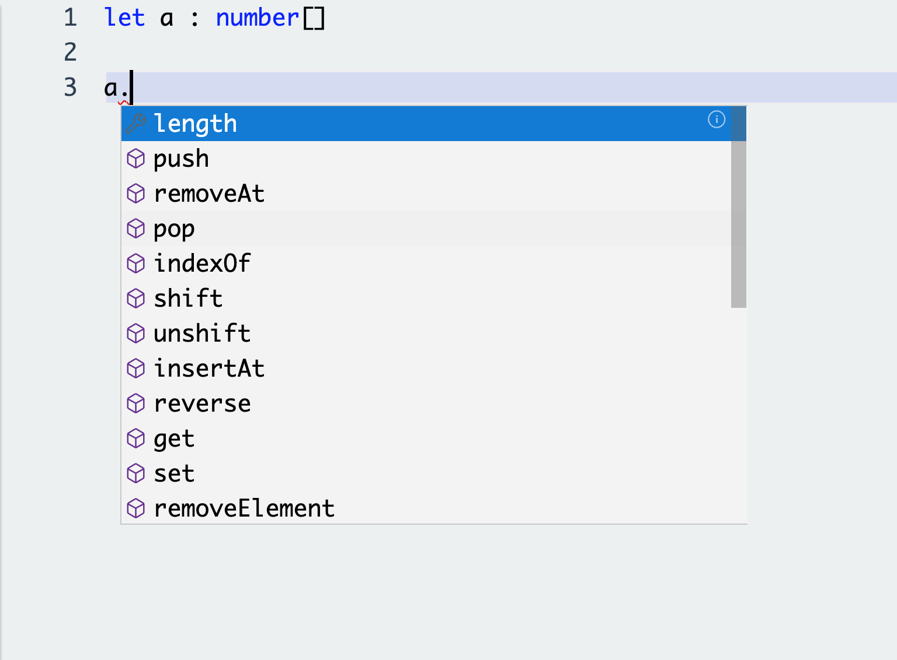
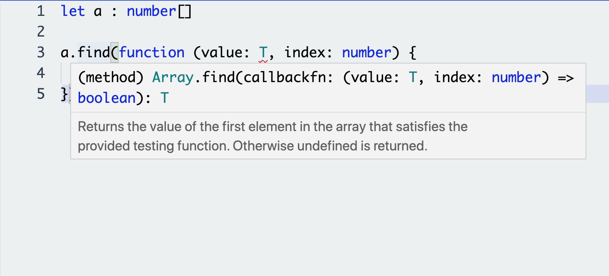

# CPE 1040 - Fall 2020

This is learning progression 003 for the Fall 2020 installment of the course CPE 1040: Introduction to Computer Engineering at MSU Denver.

Table of Contents
=================

* [CPE 1040 \- Fall 2020](#cpe-1040---fall-2020)
* [Table of Contents](#table-of-contents)
  * [Learning Progression 003: Screensavers (Part 1)](#learning-progression-003-screensavers-part-1)
    * [1\. Arrays revisited](#1-arrays-revisited)
      * [1\. Study](#1-study)
        * [Arrays](#arrays)
        * [Array methods](#array-methods)
        * [Multi\-dimensional arrays](#multi-dimensional-arrays)
      * [2\. Apply](#2-apply)
      * [3\. Present](#3-present)
    * [2\. Screensavers](#2-screensavers)
      * [1\. Study](#1-study-1)
        * [Overview](#overview)
        * [Code writing](#code-writing)
        * [Rain](#rain)
        * [Frequency bar](#frequency-bar)
      * [2\. Apply](#2-apply-1)
      * [3\. Present](#3-present-1)
    * [3\. Program structure](#3-program-structure)
      * [1\. Study](#1-study-2)
        * [Overall program structure](#overall-program-structure)
        * [Global variables](#global-variables)
        * [Function and class declarations](#function-and-class-declarations)
        * [Event handler registrants](#event-handler-registrants)
        * [Main program (forever loop)](#main-program-forever-loop)
        * [Proper indentation](#proper-indentation)
      * [2\. Apply](#2-apply-2)
      * [3\. Present](#3-present-2)
    * [4\. Divide &amp; conquer: program decomposition](#4-divide--conquer-program-decomposition)
      * [1\. Study](#1-study-3)
        * [Two modes: working &amp; asleep](#two-modes-working--asleep)
        * [Sub\-programs](#sub-programs)
        * [Matching gestures and screensavers](#matching-gestures-and-screensavers)
      * [2\. Apply](#2-apply-3)
      * [3\. Present](#3-present-3)
  * [Learning Progression 003: Screensavers (Part 2)](#learning-progression-003-screensavers-part-2)
    * [5\. Randomized behavior](#5-randomized-behavior)
      * [1\. Study](#1-study-4)
        * [Importance of randomization](#importance-of-randomization)
        * [Pseudorandom numbers](#pseudorandom-numbers)
        * [Random functions](#random-functions)
        * [Randomization in the target program](#randomization-in-the-target-program)
        * [Bouncing marbles](#bouncing-marbles)
        * [Simulator infidelity](#simulator-infidelity)
        * [Thread unsafety](#thread-unsafety)
      * [2\. Apply](#2-apply-4)
      * [3\. Present](#3-present-4)
    * [6\. Encapsulation](#6-encapsulation)
      * [1\. Study](#1-study-5)
        * [Benefits of encapsulation](#benefits-of-encapsulation)
        * [Functions](#functions)
        * [Classes](#classes)
        * [Namespaces](#namespaces)
      * [2\. Apply](#2-apply-5)
      * [3\. Present](#3-present-5)
    * [7\. Functions revisited](#7-functions-revisited)
      * [1\. Study](#1-study-6)
        * [Input\-output contract](#input-output-contract)
        * [Pass by value vs pass by reference](#pass-by-value-vs-pass-by-reference)
        * [Function naming](#function-naming)
        * [Recursive functions](#recursive-functions)
      * [2\. Apply](#2-apply-6)
      * [3\. Present](#3-present-6)
    * [8\. Classes revisited](#8-classes-revisited)
      * [1\. Study](#1-study-7)
        * [Classes are type definitions](#classes-are-type-definitions)
        * [Exceptions](#exceptions)
        * [Objects are dictionaries](#objects-are-dictionaries)
        * [Getters and setters](#getters-and-setters)
      * [2\. Apply](#2-apply-7)
      * [3\. Present](#3-present-7)
    * [9\. Code reading](#9-code-reading)
      * [1\. Study](#1-study-8)
      * [2\. Apply](#2-apply-8)
      * [3\. Present](#3-present-8)
    * [10\. Iterative development with Github](#10-iterative-development-with-github)
      * [1\. Study](#1-study-9)
      * [2\. Apply](#2-apply-9)
      * [3\. Present](#3-present-9)
    * [11\. Reactive system](#11-reactive-system)
      * [1\. Study](#1-study-10)
      * [2\. Apply](#2-apply-10)
      * [3\. Present](#3-present-10)
    * [12\. Matrix dynamics](#12-matrix-dynamics)
      * [1\. Study](#1-study-11)
      * [2\. Apply](#2-apply-11)
      * [3\. Present](#3-present-11)


## Learning Progression 003: Screensavers (Part 1)
[[toc](#table-of-contents)]

This progression is the culmination of the first part of the course, in which we program the bear-bones micro:bit without any extenral circuitry attached and without communication features. We pull together all the programming language features and best practices that we introduced in the previous two learning progressions, to write a significantly larger target program over 12 steps. This will present the opportunity to learn about some of the design considerations a programmer makes when approaching a larger project. The progression is also going to dig a bit deeper into the _softare stack_ of the micro:bit, and uncover the ways it affects these considerations.

### 1. Arrays revisited  
[[toc](#table-of-contents)]

#### 1. Study  
[[toc](#table-of-contents)]

##### Arrays
[[toc](#table-of-contents)]

`[<lernact-rd>]`We have already seen how versatile and powerful arrays can be in a program, allowing us to achieve complex program behavior far more easily than if arrays weren't available to the programming language. Let's quickly review what arrays are. An `[<cept>]`_array_ is an _ordered sequence_ of elements _of the same type_. Because it holds more than one piece of data, it is also called a `[<cept>]`[_data structure_](https://en.wikipedia.org/wiki/Data_structure). Like any other variable and function, an array has a _name_. This name can be used to refer not only to the whole array, but to individual elements of the array. Because they are ordered, they can be referenced by `[<cept>]`_index_, that is, by their place in the order, using the `[<cept>]`_selection operator_ `[]` (opening and closing square bracket). Let's take a look:
```javascript
// Example 1.1.1

let firstPrimes : number[] = [1, 3, 5, 7, 11, 13, 17, 19, 23, 31]

let favoritePrime : number = firstPrimes[3]  // selects 7

for (let i = 0; i < firstPrimes.length; i ++) {
    if (firstPrimes[i] != favoritePrime) {
        basic.showNumber(firstPrimes[i])
    } else {
        basic.showString("My favorite prime is " + favoritePrime.toString() + "!")
    }
}
```
As we can see, the `[]` operator is used heavily with arrays. In fact, that's how you can spot array variables in a program even if you are not looking at the array declaration. Let's enumerate its uses:
1. In `let firstPrimes...`, it indicates an array data type by attaching to the right of the `[<cept>]`_base type_. We are declaring an array of numbers, so the base time is `number`, and the type of the array variable `firstPrimes` is `number[]`. The single pair of brackets `[]` also indicates that this is `[<cept>]`_unidimensional_ array.  
2. In `let favoritePrime...`, it selects a particular element of the array, in this case the one with index 3, making it the forth element. Note that the array index always starts at 0.  
3. In `firstPrimes[i]`, it picks out the element, the index of which is equal to the current value of the loop variable `i`. So, the `[]` operator admits `[<cept>]`_expressions_ between the brackets, as long as they evaluate to an `[<cept>]`_integer_ value. That is, the result of evaluating the expression has to be a whole number. In addition, the integer has to be in the index `[<cept>]`_range_ of the array. That is, the number between the brackets has to be among the valid indices of the array. In our case, the range is [0, 9].  

##### Array methods
[[toc](#table-of-contents)]

`[<lernact-rd>]`The usefulness of the arrays doesn't stop with the ability to keep a collection of data together. Arrays come with many useful `[<cept>]`_methods_ and `[<cept>]`_properties_ for manipulating the elements of the collection or the whole collection itself. In Example 1.1.1, we already encountered the `length` property. The best way to explore methods in MakeCode is to declare an array variable, invoke the dropdown by using the `.` selection operator to pick a method or property, 

  

and then hover over the name to invoke the documentation popup.

  

Before we review the array methods, we need to point out what the difference is between methods and properties. Looking back at the material on classes in the previous learning progression, we can see that the array methods look like class methods and the `length` property as a `[<cept>]`_class field_, that is, a data point. The actual implementation is a bit more complicated, due to the need for MakeCode to support devices other than the micro:bit, but from our purposes, we can think of these methods and property as defined in the class `Array`. _Methods_ are called like functions, with parentheses `()`, as in `arr.reverse()`, while _properties_ are called like data fields, without parentheses, as in `arr.length`.

Use the following functions to look at the contents of arrays in the next examples:
```javascript
// Example 1.1.2

function showNumericArray(a : number[]) {
   for (let i=0; i<a.length; i++) {
      basic.showNumber(a[i])
   }
}

function showStringArray(a : string[]) {
   for (let i=0; i<a.length; i++) {
      basic.showString(a[i])
   }
}
```

Now, let's look at the available methods systematically, grouping them by general function:
1. Content methods insert, remove, and replace elements of the array, changing its contents. These are (Note: Arguments, if any, are omitted for brevity.):
   - `push()`, also known as _"append"_, adds an element at the end of the array.    
   - `pop()` removes the last element and returns it.  
   - `insertAt()` inserts an element at an index.  
   - `removeAt()` removes an element at an index.    
   - `set()` sets the value of an element at an index.  
   - `removeElement()` removes the first occurrence of an element.    
   - `fill()` Read the JS documentation on its [usage](https://developer.mozilla.org/en-US/docs/Web/JavaScript/Reference/Global_Objects/Array/fill).)  
   - `shift()` remove an element from the beginning of the array and return the new length.  
   - `unshift()` add an element at the beginning of the array and return the new length.  
   - `splice()` removes a number of elements from an array, starting at an index.  
   ```javascript
   // Example 1.1.3
   let a : number[] = [5, 8, 12, 91, 41, 0, 22]
   a.push(13)
   showNumericArray(a)
   
   basic.showNumber(a.pop())
   
   a.insertAt(2, 56)
   showNumericArray(a)

   basic.showNumber(a.removeAt(1))
   
   a.set(0, 22)
   showNumericArray(a)
   
   if (a.removeElement(22)) {
       basic.showString("Successfully removed!") 
       showNumericArray(a)
   }

   a.fill(87, 2, 4)
   showNumericArray(a)
   ```
2. Accessor methods:
   - `get()` return the value of the element at an index. `a.get(5)` is equivalent to `a[5]`.  
   - `indexOf()` returns the index of an element, if found, or `-1`, if not found.  
   - `find()` returns the value of the first element in the array that satisfies the boolean criterion function passed as argument.  
   - `slice()` returns a section of an array between two indices as another array.  
   ```javascript
   // Example 1.1.4
   let a : number[] = [5, 8, 12, 91, 41, 0, 22]
   basic.showNumber(a.indexOf(91))  // returns 3
   
   basic.showNumber(a.indexOf(87))  // returns -1 (no 87 in the array)
   
   function odd(a : number, index : number) { return a % 2 == 1 }  // the second parameter is required though not used
   basic.showNumber(a.find(odd))
   
   let c = a.slice(2, 5)  // the end index, here 5, is not included
   showNumericArray(c)
   ```
3. Order methods, which change the order of the elements:
   - `reverse()` permanently reverses the order of the elements of the array on which it was called.  
   - `sort()` returns the array sorted `[<cept>]`_in place_, meaning the array remains sorted after the call. `reverse()` is also in-place.    
   ```javascript
   // Example 1.1.5
   
   let a : number[] = [5, 8, 12, 91, 41, 0, 22]
   a.reverse()
   showNumericArray(a)
   showNumericArray(a.sort())  // note that the array a is now sorted
   ```
4. Methods on two arrays:
   - `concat()` returns a new array with the argument array concatenated (that is, appended) to the array on which it was called.  
   ```javascript
   // Example 1.1.6
   
   let a : number[] = [5, 8, 12]
   let b : number[] = a.concat([91, 41, 0, 22])
   showNumericArray(b)
   ```
5. String-specific methods:
   - `join()`, for `string` arrays, concatenates the elements, delimited by a `[<cept>]`_separator_.  
   ```javascript
   // Example 1.1.7

   let a : string[] = ["Learning", "progression", "003"]
   showStringArray(b)
   basic.showString(a.join(" "))  // the separator is a space (that is, " ")
   ```
6. Boolean methods:
   - `every()` tests of all elements satisfy a criterion specified as a funciton.   
   - `some()` tests of all elements satisfy a criterion specified as a funciton.  
   ```javascript
   // Example 1.1.8

   let a : number[] = [5, 8, 12]

   function odd(a : number, index : number) { return a % 2 == 1 }  // the second parameter is required though not used
   function even(a : number, index : number) { return a % 2 == 0 }  // the second parameter is required though not used

   if (a.every(odd))
      basic.showString("All odd!")
   else if (a.every(even))
      basic.showString("All even!")
   else
      basic.showString("Even and odd!")
   ```
7. General methods applying a `[<cept>]` callback function on every element. (Notice that `find()`, `every()`, and `some()` also take callbacks as arguments, but they have very specific function.)
   - `map()` applies a callback function to each element of an array and returns the resulting array. The original array is not modified.  
   - `forEach()` applies a callback function to each element of an array.  The original array is not modified.  
   - `reduce()` applies a callback function to each element, while aggregating the result.  
   ```javascript
   // Example 1.1.9
   let words : string[] = ["HIPY", "PAPY", "BTHUTHDTH", "THUTHDA", "BTHUTHDY"]

   showStringArray(words.map(function (value: string, index: number) {
       return value.toLowerCase()
   }))

   let shortWords : string[] = ["hop", "baby", "nose", "scat", "grog"]

   shortWords.forEach(function (value: string, index: number) {
       let numeral : string
       switch (index) {
           case 0:
           numeral = "first"
           break
           case 1:
           numeral = "second"
           break
           case 2:
           numeral = "third"
           break
           default:
           numeral = `${ index + 1 }th`
           break
       }
       basic.showString(`The ${ numeral }th element is ${ value }.`)
   })
   
   let a : number[] = [4, 9, 2, 4]

   basic.showString(`The sum of array elements is ${ 
       a.reduce(
           function (previousValue: number, currentValue: number, currentIndex: number) {
               return previousValue + currentValue
           }, 
           null) 
   }`)
   ```
##### Multi-dimensional arrays
[[toc](#table-of-contents)]

`[<lernact-rd>]`Multi-dimensional arrays are _arrays of arrays_. In other words, the base type of multi-dimensional array is also a (multi-dimensional) array. The number of dimensions is indicated by the number of `[]` pairs after the base type of the innermost array, as in `let threeDimensionalGrid : number[][][]`. The indexing of elements works by level, from the outermost to the innermost, as in `threeDimensionalGrid[5][4][10]` references the value of _the element of index 10 of the element of index 4 of the element of index 5_. This is a lot easier to understand with an example:
```javascript
// Example 1.1.10

let path = [
    [0, 0], [1, 0], [2, 0], [3, 0], [4, 0], // top row to the right
    [4, 1], [4, 2], [4, 3], [4, 4],         // right column down
    [3, 4], [2, 4], [1, 4], [0, 4],         // bottom row to the left
    [0, 3], [0, 2], [0, 1],                 // left column up
    [1, 1], [2, 1], [3, 1],                 // top but 1 row to the right (remaining headitions)
    [3, 2], [3, 3],                         // right but 1 column down (remaining headitions)
    [2, 3], [1, 3],                         // bottom but 1 row to the left (rem head)
    [1, 2],                                 // left but 1 col up (rem head)
    [2, 2]                                  // center
]

const SNAKE_LEN: number = 7                 // snake length parameter
let snake: number[] = []                    // snake represented by trajectory indices
for (let i = - SNAKE_LEN; i < 0; i++)
    snake.push(i)                           // populate snake array

// the snake goes back and forth along the path
basic.forever(function () {
    let head: number = 0
    let tail: number
    while (head < 25) {
        led.plot(path[head][0], path[head][1])
        snake.push(head++)
        tail = snake.removeAt(0)
        if (tail >= 0)
            led.unplot(path[tail][0], path[tail][1])
        basic.pause(200)
    }

    // reverse the snake "in place"
    head = tail
    tail = 24
    while (tail > 0) {
        if (head >= 0)
            led.plot(path[head][0], path[head][1])
        snake.insertAt(0, head--)
        tail = snake.pop()
        led.unplot(path[tail][0], path[tail][1])
        basic.pause(200)
    }
})
```
Things to notice here:
1. The `path` variable is a two-dimensional array representing the trajectory of the snake. It contains 25 (x, y) positions on the 5x5 grid, which are so arranged that the `snake` travels along a tightening spiral, touching every position in the grid.  
2. The `snake` itself is a one-dimensional array of 7 consecutive indices into the the `path` array. `head` is the index of the snake's front, and `tail` is the index of the snake's back. The snake travels head forward. So, to show the snake, we use calls to `led.plot()` with coordinates `path[head][0]` for the x parameter and `path[head][1]` for the y parameter.  
3. Because the snake is moving, we advance the `head` and remove at the `tail`.
    
#### 2. Apply  
[[toc](#table-of-contents)]

1. `[<lernact-prac>]`Create an array of the numbers 1 to 100, inclusive. Do not waste your time typing the numbers. Write a loop and use the appropriate array method to add elements. In a separate loop, display the last 17 numbers.  
2. `[<lernact-prac>]`Using the method of the [Sieve of Eratosthenes](https://www.smartickmethod.com/blog/math/operations-and-algebraic-thinking/divisibility/prime-numbers-sieve-eratosthenes/), update your program from 1.2.1 to go through the array and leave only the prime numbers. Show the remaining numbers in a loop.  
3. `[<lernact-prac>]`Modify the program from Example 1.1.10 so that the snake appears from the center, goes to the top left corner and returns back.

#### 3. Present  
[[toc](#table-of-contents)]

In the [programs](programs) directory:
1. Add your program from 1.2.1 with filename `microbit-program-1-2-1.js`.  
2. Add your program from 1.2.2 with filename `microbit-program-1-2-2.js`.  
3. Add your program from 1.2.3 with filename `microbit-program-1-2-3.js`.  

In the [Lab Notebook](README.md):
1. Link to the program from 1.2.1.  
2. Link to a demo video showing the execution of the program from 1.2.1.  
3. Link to the program from 1.2.2.  
4. Link to a demo video showing the execution of the program from 1.2.2.  
5. Link to the program from 1.2.3.  
6. Link to a demo video showing the execution of the program from 1.2.3.  


### 2. Screensavers   
[[toc](#table-of-contents)]

#### 1. Study
[[toc](#table-of-contents)]

##### Overview

`[<lernact-rd>]`This progression has a significant target program as an end goal. This allows us to visit programming topics that would otherwise not arise in a sequence of small few-line example programs. Some of these topics concern programming as a process (e.g. program decomposition, encapsulation, program structure), others have to do with computer resources (e.g. efficient coding, achieving desired behavior within the memory and processor speed limitations of the target device), and still others address user interface design (e.g. responsiveness, intuitive dynamics). The details of the implementation of the computer's software stack may bear directly on any of these topics. Exploring these is the point of this progression, and thus it is the culmination of the first part of the course, in which we only program the bear micro:bit, without any external circuitry.

The target program consists of several smaller sub-programs, which jointly simpulate a computer, on which a programmer codes, and on which various screensavers display when the computer is "asleep". See this overview [video of the overall program operation](https://msudenver.yuja.com/Dashboard/Permalink?authCode=1778867948&b=1761370&linkType=video), including the coding simulation in work mode and two sceensavers, one simulating rain and the other a frequency bar.

##### Code writing

Here is a longer [video of the code-writing simulation](https://msudenver.yuja.com/Dashboard/Permalink?authCode=5150693&b=1799587&linkType=video). Notice the scrolling after the first page is exhausted.

##### Rain

Here is a longer [video of the rain simulation screensaver](https://msudenver.yuja.com/Dashboard/Permalink?authCode=1875257468&b=1799524&linkType=video). Notice how the "farther" (dimmer) raindrops, which look like they are falling in the background, are falling _slower_. Similarly, the ones at the forefront, are brightest and fall fastest. This is what you would see if you are looking at rain.

##### Frequency bar

Here is a longer [video of the frequency bar simulation screensaver](https://msudenver.yuja.com/Dashboard/Permalink?authCode=45885861&b=1799554&linkType=video). Notice how the highest point to which a frequency column rises in a single beat lingers lit up until the column fades down completely. This is common behavior of frequency bars, in which the overall frequency envelope of the music signal is displayed.
     
#### 2. Apply
[[toc](#table-of-contents)]

1. `[<lernact-prac>]`Write a standalone program to simulate the code writing sub-program. Guidelines and hints:
   1. First, write a program that can draw 5 "program lines" of different lengths, from left to right.  
   2. Notice that at all times, there are _at most_ 5 lines on the screen. Does that perhaps suggest an array of line lengths? How would you add and remove lines to keep it at most 5-element long?  
   3. Finally, notice that while writing the "first page" of the program, there is no scrolling until the fifth line is reached. How would you modify your program to achieve this?  
   
2. `[<lernact-prac>]`Write a standalone program to simulate rain for one of the screensavers. Guidelines and hints:
   1. First, write a program to have LED "raindrops" fall from top to bottom, and disappear at the bottom of the screen.  
   2. Now make them vary in brightness.  
   3. Now think how you can have some of the go faster than others, and match that with the brightness. _You don't have to get this right in this step, but it will help to think about it and generate some ideas._
   
3. `[<lernact-prac>]`Write a standalone program to simulate a frequency bar for one of the screensavers. Guidelines and hints:
   1. First, write a program that can plot LED columns _from botton to top_ and back. _Note the vertical coordinate grows from top to bottom, so you will need to invert it._    
   2. Randomize the height the way you randomized the line length in the code-writing simulation, and make the highest point show at highest brightness. _Can you see another application of an array of highest point vertial coordinates?_    
   3. How would you make the column retreat down while the highest point stays until the columns is gone, and only then turns off?  

#### 3. Present
[[toc](#table-of-contents)]

In the [programs](programs) directory:
1. Add your program from 2.2.1 with filename `microbit-program-2-2-1.js`.  
2. Add your program from 2.2.2 with filename `microbit-program-2-2-2.js`.  
3. Add your program from 2.2.3 with filename `microbit-program-2-2-3.js`.  

In the [Lab Notebook](README.md):
1. Link to the program from 2.2.1.  
2. Link to a demo video showing the execution of the program from 2.2.1.  
3. Link to the program from 2.2.2.  
4. Link to a demo video showing the execution of the program from 2.2.2.  
5. Link to the program from 2.2.3.  
6. Link to a demo video showing the execution of the program from 2.2.3.  


### 3. Program structure  
[[toc](#table-of-contents)]

#### 1. Study
[[toc](#table-of-contents)]

##### Overall program structure

`[<lernact-rd>]`In a large program, proper structure is essential. While the particular structure is somewhat arbitrary, general guidelines and conventions are quick to appear in any programming domain. One important factor in coming up with a good structure for a large program is whether the program can contain multiple files or just a single one. The MakeCode micro:bit environment allows for only one user-defined source file at a time, with all the rest of the functionality (language runtime, device runtime, MakeCode and user-defined packages) all come precompiled and are not modifiable from inside the user program. For our single-file micro:bit programs, the following structure has emerged:

```
 _____ _       _           _                   _       _     _            
|  __ \ |     | |         | |                 (_)     | |   | |           
| |  \/ | ___ | |__   __ _| | __   ____ _ _ __ _  __ _| |__ | | ___  ___  
| | __| |/ _ \| '_ \ / _` | | \ \ / / _` | '__| |/ _` | '_ \| |/ _ \/ __| 
| |_\ \ | (_) | |_) | (_| | |  \ V / (_| | |  | | (_| | |_) | |  __/\__ \ 
 \____/_|\___/|_.__/ \__,_|_|   \_/ \__,_|_|  |_|\__,_|_.__/|_|\___||___/ 
                                                                          
 __________________________________________________________________________________________________________________ 
/_____/_____/_____/_____/_____/_____/_____/_____/_____/_____/_____/_____/_____/_____/_____/_____/_____/_____/_____/ 
                                                                          


  ______                _   _                               _        _                     _           _                 _   _                 
 |  ____|              | | (_)                             | |      | |                   | |         | |               | | (_)                
 | |__ _   _ _ __   ___| |_ _  ___  _ __     __ _ _ __   __| |   ___| | __ _ ___ ___    __| | ___  ___| | __ _ _ __ __ _| |_ _  ___  _ __  ___ 
 |  __| | | | '_ \ / __| __| |/ _ \| '_ \   / _` | '_ \ / _` |  / __| |/ _` / __/ __|  / _` |/ _ \/ __| |/ _` | '__/ _` | __| |/ _ \| '_ \/ __|
 | |  | |_| | | | | (__| |_| | (_) | | | | | (_| | | | | (_| | | (__| | (_| \__ \__ \ | (_| |  __/ (__| | (_| | | | (_| | |_| | (_) | | | \__ \
 |_|   \__,_|_| |_|\___|\__|_|\___/|_| |_|  \__,_|_| |_|\__,_|  \___|_|\__,_|___/___/  \__,_|\___|\___|_|\__,_|_|  \__,_|\__|_|\___/|_| |_|___/
                                                                                                                                               
                                                                                                                                               
 __________________________________________________________________________________________________________________ 
/_____/_____/_____/_____/_____/_____/_____/_____/_____/_____/_____/_____/_____/_____/_____/_____/_____/_____/_____/ 
                                                                          

  ______               _          _                     _ _                            _     _                   _       
 |  ____|             | |        | |                   | | |                          (_)   | |                 | |      
 | |____   _____ _ __ | |_ ______| |__   __ _ _ __   __| | | ___ _ __   _ __ ___  __ _ _ ___| |_ _ __ __ _ _ __ | |_ ___ 
 |  __\ \ / / _ \ '_ \| __|______| '_ \ / _` | '_ \ / _` | |/ _ \ '__| | '__/ _ \/ _` | / __| __| '__/ _` | '_ \| __/ __|
 | |___\ V /  __/ | | | |_       | | | | (_| | | | | (_| | |  __/ |    | | |  __/ (_| | \__ \ |_| | | (_| | | | | |_\__ \
 |______\_/ \___|_| |_|\__|      |_| |_|\__,_|_| |_|\__,_|_|\___|_|    |_|  \___|\__, |_|___/\__|_|  \__,_|_| |_|\__|___/
                                                                                  __/ |                                  
                                                                                 |___/                                   
 __________________________________________________________________________________________________________________ 
/_____/_____/_____/_____/_____/_____/_____/_____/_____/_____/_____/_____/_____/_____/_____/_____/_____/_____/_____/ 
                                                                          

  __  __       _                                                      ____                                _                 __  
 |  \/  |     (_)                                                    / / _|                              | |                \ \ 
 | \  / | __ _ _ _ __    _ __  _ __ ___   __ _ _ __ __ _ _ __ ___   | | |_ ___  _ __ _____   _____ _ __  | | ___   ___  _ __ | |
 | |\/| |/ _` | | '_ \  | '_ \| '__/ _ \ / _` | '__/ _` | '_ ` _ \  | |  _/ _ \| '__/ _ \ \ / / _ \ '__| | |/ _ \ / _ \| '_ \| |
 | |  | | (_| | | | | | | |_) | | | (_) | (_| | | | (_| | | | | | | | | || (_) | | |  __/\ V /  __/ |    | | (_) | (_) | |_) | |
 |_|  |_|\__,_|_|_| |_| | .__/|_|  \___/ \__, |_|  \__,_|_| |_| |_| | |_| \___/|_|  \___| \_/ \___|_|    |_|\___/ \___/| .__/| |
                        | |               __/ |                      \_\                                               | |  /_/ 
                        |_|              |___/                                                                         |_|      
```
ASCII art acknowledgement: [taag](http://patorjk.com/software/taag/#p=display&f=Big&t=Type%20something)

In the rest of the sections, we'll briefly explain each of these program regions. All examples are assembled in the program in Example 3.1.1 at the end of the Study section.

##### Global variables

Global variables are variables that are in the top-level scope of the program, and are thus visible to all the program's components, including functions and classes. They are the main _program data_ (aka `[<cept>]`_program state_). In general, there should be a minimal number of global variables, thought the single-file environment mitigates most of the risks. Nevertheless, it makes good sense to put the at the very top of the program. This makes them easy to find, helps avoid duplication, and gives a brief overview of the program to a new reader. In Example 3.1.1, our global variable, against which all program operations are performed, is the `balls` array.

##### Function and class declarations

Functions and classes are _named_ encapsulation structures, which help modularize the program code and prevent duplication of code. Functions have input and output, and can have local data needed for their operation. Functions are `[<cept>]`_called_ by invoking their name and specifying the necessary arguments, if any, between parentheses. While not all functions have `[<cept>]`_parameters_ (meaning the declarations of the `[<cept>]`_arguments_), a function call **requires** the parentheses `()`. In Example 3.1.1, we have two functions, `createBalls()` and `bounceBalls()`. Note that they have distinct functionality, properly communicated by their names.

Classes are the backbone of the object-oriented programming paradigm, allowing programmers to define their own types, known as `[<cept>]`_user-defined types_, by encapsulating complex data and determiniting the exact set of computational operations that can be performed on them. Classes are thus the templates for the creation of user-type entities, called `[<cept>]`_objects_.

Keeping functions and classes clustered together follows the `[<cept>]`_library_ (aka `[<cept>]`_application programming interface (API)_) paradigm, in which all the functions and user data types available to the programmer are presented in an exhaustive and descriptive list.

##### Event handler registrants

Events are phenomena, internal or external to the computer's processor, that the processor has to be informed of. There are two ways to communicate events to the processor: `[<cept>]`_interrupts_, which are signals sent by the event originator to the processor and which the processor inteprets and acts on, and `[<cept>]`_polling_, which is a process of cyclic interrogation of the possible originators by the processor. The micro:bit actually uses a hybrid method, where on the hardware level interrupts are used, but the device and language runtimes actually implement polling. The MakeCode packages which are involved in, among other thigns, various event detection and response are `input`, `pins`, `radio`, `conrol`, and `serial`. The way the processor and/or runtime responds to an event is by assigning an `[<cept>]`_event-handler_ function to each event. In MakeCode, this is done by event-handler `[<cept>]`_registrants_, which are themselves functions, which take the event-handler functions as one of their arguments. In Example 3.1.1, we have a `Gesture` event-handler registrant, called `input.onGesture`. It takes two arguments: the name of the gesture, in this case `Shake`, and the event-handler to be executed upon detection of the shake-gesture event, namely `function () { balls = createBalls(); }`.

Due to the way they are executed, event handlers should not be put inside loops, functions, or classes, but at the top level of the program, and clustered together so that it is easy to see at a glance what events the program is listening to. More on this in a later step.

##### Main program (forever loop)

The main program contains the main program loop, in the case of MakeCode micro:bit, most often a `basic. forever()` loop function. It is best to keep the contents of the loop short and descriptive, usually by encapsulating the details away into functions and classes. In Example 3.1.1, the only function that the main program loop is calling is `bounceBalls()`, and nothing else, making the intent of the program exceedingly obvious and setting firm expectations of the program behavior that may be observed.

##### Proper indentation

Lastly, proper program structure can be easily defeated if the proper language-specific indentation style is not adopted. In general, the rules are as follows:
1. Top-level constructs (e.g. declarations) start at column 0 (that is, flush against the left-hand edge of the editor).  
2. Each encapsulation (aka scope) nesting (e.g. function block/body, conditional statement block/body, and the full contents of a class) are started **4 characters in**.  
3. Whether the opening brace `{` of a block is at the end of the preceding line, like
```javascript
function foo() {
    // function body
}
```
or at the start of the new line, 
```javascript
function foo() 
{
    // function body
}
```

is a matter of personal style, but it should be _consistent_.

Notice how the proper indentation and consistent style in Example 3.1.1 makes the program easy to read and comprehend at a glance.

```javascript
// Example 3.1.1

/* *** Global variables *** */
let balls : game.LedSprite[] = []

/* *** Function declarations *** */
function createBalls() {
    for (let i = 0; i < 3; i ++) {
        let ball = game.createSprite(Math.randomRange(0, 4),
                                     Math.randomRange(0, 4))
        if (Math.randomBoolean()) {
            if (Math.randomBoolean()) {
                ball.turnLeft(45)
            } else {
                ball.turnRight(45)
            }
        }
        balls.push(ball)
    }
    return balls
}

function bounceBalls() {
    if (balls.length > 0) {
        for (let i = 0; i < 20; i ++) {
            for (let b = 0; b < balls.length; b ++) {
                balls[b].move(1)
                basic.pause(50)
                balls[b].ifOnEdgeBounce()
            }
        }
        for (let b = 0; b < balls.length; b ++)
            balls[b].delete()
    }    
}

/* *** Event-handler registrants *** */
input.onGesture(Gesture.Shake, function () {
    balls = createBalls()
})

/* *** Main program (forever loop) *** */
basic.forever(function () {
    bounceBalls()
})
```

#### 2. Apply
[[toc](#table-of-contents)]

1. `[<lernact-prac>]`Rewrite your program from 2.2.1 to follow the structure presented in this step. Requirements:
   1. The code for the coding simulation should be encapsulated in a funciton, called `coding`.  
   2. The `basic.forever` loop should only call `coding()` and nothing else.  
   
2. `[<lernact-prac>]`Rewrite your program from 2.2.2 to follow the structure presented in this step. Requirements:
   1. The functionality for a raindrop should be encapsulated in a class, called `Raindrop`. You may or may not subclass from `game.LedSprite`, as you wish. Refer to LP002-[9-11] for an example.  
   2. The actual rain should be encapsulated in a function, called `rain`.  
   3. The `basic.forever` loop should only call `rain()` and nothing else.  
   
3. `[<lernact-prac>]`Rewrite your program from 2.2.3 to follow the structure presented in this step. Requirements:  
   1. The code for the coding simulation should be encapsulated in a funciton, called `freqBars`.  
   2. The `basic.forever` loop should only call `freqBars()` and nothing else.  


#### 3. Present
[[toc](#table-of-contents)]
   
In the [programs](programs) directory:
1. Add your program from 3.2.1 with filename `microbit-program-3-2-1.js`.  
2. Add your program from 3.2.2 with filename `microbit-program-3-2-2.js`.  
3. Add your program from 3.2.3 with filename `microbit-program-3-2-3.js`.  

In the [Lab Notebook](README.md):
1. Link to the program from 3.2.1.  
2. Link to a demo video showing the execution of the program from 3.2.1.  
3. Link to the program from 3.2.2.  
4. Link to a demo video showing the execution of the program from 3.2.2.  
5. Link to the program from 3.2.3.  
6. Link to a demo video showing the execution of the program from 3.2.3.  


### 4. Divide & conquer: program decomposition  
[[toc](#table-of-contents)]

#### 1. Study
[[toc](#table-of-contents)]

##### Two modes: working & asleep

`[<lernact-rd>]`It is good to create a development plan for a program that is expected to be large. The most powerful technique is `[<cept>]`_decomposition_, the breaking up of a large task into smaller pieces, each one of them as independent from the others as possible. In a previous Step, we saw some sub-programs of the large target program, namely the `coding()`, `rain()`, and `freqBars()` functions, each encapsulating an independent simulation. So, we have actually already made steps toward decomposing the large program, specifically by taking a `[<cept>]`_bottom-up_ approach, in which we first build the small consituent pieces, which we will put together later. 

From the opposite direction, in what we can call `[<cept>]`_top-down_ approach, the high-level structure of the program is that it has _two mutually exclusive modes_, "working" and "asleep", which have no program behavior in common. Such a case is ideal for a small `enum` class, which creates a type of _named_ elements, as in the following example:
```javascript
// Example 4.1.1

enum Mode { Asleep = 0, Working }

let mode : Mode = Mode.Asleep
```
This is helpful because it maintains maximum _"self-describability"_ of the program. We don't need excessive comments, if the program itself reads like a narrative.

In mode `Working`, we call the `coding()` sub-program, while in mode `Asleep`, we call whichever sub-program corresponds to the last gesture detected (or the default). We can accomplish this easily within a single `basic.forever() {}` loop, which is ideal for our overall program structure.

##### Sub-programs

The most important aspects of the sub-programs `coding()`, `rain()`, and `freqBars()` is that they are _independent of each other_ and are _similarly encapsulated_. Towards the first aspect, only one of these programs is running at a time, and no other program is running _in the background_ to compete for computing resources or perturb the timing of the program currently executing. Toward the second aspect, all of these sub-programs are encapsulated as functions with the same signature, namely no parameters and no return type, as in `function foo() : void {}`. This makes them easy to call from the same place, in our case the `basic.forever()` loop.

We have only looked at 2 screensavers (meaning the programs running in `Asleep` mode) so far, but now that we have a solid program structure, both bottom-up and top-down, we can easily go about developing and adding other screensavers. Just wrap them into a `void` function with no parameters, whether the internal implementation is a function or a class, and add it to the options for the `Asleep` mode. We see two important properties of well-structured programs: `[<cept>]`_implementation hiding_, which dictates that the implementation details for a certain independent program component need not be visible (in other words, at the top level of the program, we don't care about how a particular screensaver sub-programs is implemented), and `[<cept>]`_extensibility_, which allows for seamless extension of the functionality of the large program by just adding more options, without changing the overall design and structure.

##### Matching gestures and screensavers

Here, we will also see how the encapsulation, implementation hiding, and extensibility of our structured program design will help us with keeping the main program simple. In particular, how do we match gestures and screensaver programs? Do we use `if...else` cascades, a `switch` statement, or some other construct. Actually, we will use the marvelous property of JavaScript (and, hence TypeScript) that it has `[<cept>]`_first-class functions_. Let's look at an example:
```javascript
// Example 4.1.2

let gesture : Gesture = Gesture.TiltLeft
let gestures : Gesture[] = [Gesture.TiltLeft, Gesture.TiltRight]

let screensavers = [rain, freqBars]
```
Notice how we have created to parallel arrays, one with gestures, one with screensavers. Notice also that, if we want to add more screensavers and matching gestures, we can just add to these global arrays. How exactly we do the matching is shown in the next example:
```javascript
// Example 4.1.3

basic.forever(function () {
    screensavers[gestures.indexOf(gesture)]()
})
```
Let's unpack this:
1. We can call a function, which is an array element, by combinging the element selection syntax for arrays and the function call syntax, as in `screensavers[0]()`, where `screensavers[0]` is just the function `rain`, and the parentheses `()` at the end end off a proper function call.  
2. Assuming that we have constructed the parallel arrays so that the gestures and screensavers match _by index_, we can use the `indexOf` method to get the index of the last gesture stored in the variable `gesture` in the `gestures` array and then apply this index in the selector for the corresponding screensaver, as we san in (1).  

#### 2. Apply
[[toc](#table-of-contents)]

1. `[<lernact-prac>]`Write a program with two modes, `Working` and `Asleep`. Requirements:
   1. A global variable `mode` of time `Mode` holds he latest gesture detected.  
   2. Mode `Working` is default.  
   3. In mode `Working`, display the single character `W`.  
   4. In mode `Asleep`, display the single character `Z`.  
   5. Button `A` sets the mode to `Asleep`.  
   6. Button `B` sets the mode to `Working`. 

2. `[<lernact-prac>]`Write a program which recognizes two gestures, `TiltLeft` and `TiltRight`. Requirements:
   1. A global variable `gesture` of type `Gesture` holds he latest gesture detected.  
   2. Gesture `TiltLeft` is default.  
   3. When gesture `TiltLeft` is detected, display the single character `L`.  
   4. When gesture `TiltRight` is detected, display the single character `R`.  
   
3. `[<lernact-prac>]`Combine the two programs. Requirements:
   1. In `Working` mode, keep calling `coding()`.  
   2. In `Asleep` mode, keep calling the screensaver function which corresponds to the last gesture detected, or the default.  
      1. `rain()` for `TiltLeft`.  
      2. `freqBars()` for `TiltRight`.  

#### 3. Present
[[toc](#table-of-contents)]
   
In the [programs](programs) directory:
1. Add your program from 4.2.1 with filename `microbit-program-4-2-1.js`.  
2. Add your program from 4.2.2 with filename `microbit-program-4-2-2.js`.  
3. Add your program from 4.2.3 with filename `microbit-program-4-2-3.js`.  

In the [Lab Notebook](README.md):
1. Link to the program from 4.2.1.  
2. Link to a demo video showing the execution of the program from 4.2.1.  
3. Link to the program from 4.2.2.  
4. Link to a demo video showing the execution of the program from 4.2.2.  
5. Link to the program from 4.2.3.  
6. Link to a demo video showing the execution of the program from 4.2.3.  

   
## Learning Progression 003: Screensavers (Part 2)
[[toc](#table-of-contents)]

This progression is the culmination of the first part of the course, in which we program the bear-bones micro:bit without any extenral circuitry attached and without communication features. We pull together all the programming language features and best practices that we introduced in the previous two learning progressions, to write a significantly larger target program over 12 steps. This will present the opportunity to learn about some of the design considerations a programmer makes when approaching a larger project. The progression is also going to dig a bit deeper into the _softare stack_ of the micro:bit, and uncover the ways it affects these considerations.

   
### 5. Randomized behavior  
[[toc](#table-of-contents)]

#### 1. Study
[[toc](#table-of-contents)]

##### Importance of randomization

`[<lernact-rd>]`We have used `[<cept>]`_randomization_ in fairly inconsequential ways so far, mostly to have somewhat unpredictable behavior of the output on the micro:bit 5 x 5 matrix. However, randomization is extremely important in science and engineering. Among other things, it allows generating important variation in test and diagnostics programs, achieving nearly-even coverage in probability distribution sampling, and good spreading in hash table storage. The full significance of randomization is well beyond the scope of this course.

##### Pseudorandom numbers

The numbers that the `random` functions return are actually `[<cept>]`[_pseudorandom_](https://en.wikipedia.org/wiki/Pseudorandom_number_generator), which means that an algorithm generates them in an extremely long evenly spread-out sequence. The number of elements in the whole sequence is so large, that in any specific location along it, there appears to be no relationship between nearby elements. Truly random functions are usually only achieved based on [random physical phenomena](https://www.random.org/randomness/).

##### Random functions

In MakeCode, we have access to three randomization functions:
1. `Math.random()` returns a pseudorandom floating-point (that is, a (possibly `[<cept>]`_truncated_) real number) number between 0 and 1. _Note that the value of 1 is [not included](https://developer.mozilla.org/en-US/docs/Web/JavaScript/Reference/Global_Objects/Math/random)._  
2. `Math.randomBoolean()` returns `true` or `false` with the evenness of a pseudorandom generator. This is akin to a `[<cept>]`_coin toss_. Just like a coin toss, you cannot expect any kind of `[<cept>]`_alternation_ of `true` and `false`. They are evenly distributed (that is, there is an approximately even number of `true` and `false` value) only in the `[<cept>]`_limit_ of `[<cept>]`_infinite_ trials.  
3. `randint(min, max)` is provided as a convenience function in MakeCode and is not usually part of the canonical JavaScript library. It returns `[<cept>]`_signed integers_, that is the values of the numbers it returns are whole numbers, which can be negative, positive, and/or zero. Curiously, the ordering of the arguments is not enforced. That is, `randint(0, 4)` is functionally equivalent to `randint(4, 0)`. _Note that both min and max are included in the range from which pseudorandom integers are returned._  

Using these functions, you can write your own randomization routines, to fit your purposes.

##### Randomization in the target program

Let's review the randomizations we have used so far in this progression, along with some implementation pointers:
1. `coding()` has a very simple randomization, namely the length of the "code lines", which can be achieved with a straightforward use of `randint(0, 5)` or `randint(1, 5)`, depending on whether we want to have empty lines or not.  
2. `freqBars()` also has a similarly simple randomization, namely the height of the bars. Again, this can be achieved with the use of `randint(0, 4)`. _Note, however, that the vertical coordinate of the LED matrix grows from 0 at the top down to 4 at the bottom, so you need to subtract the number you get from the maximum height. And you may also have to plot LEDs in an inverted `for` loop._  
3. `rain()` has a little more elaborate randomization, namely that it adopts an internal concept of _distance_ in order to move the "raindrops" differently depending on how far they are from the viewer. In particular, there are 5 levels of depth, with 0 being the "closest" and 4 being the "farthest". The raindrops are brighter in the foreground than in the background, and are moving faster across the screen in the foreground than in the background. This kind of randomization requires something other than `basic.pause()` to achieve, because `basic.pause()` causes the processor to idle, regardless of what else might also be running on it. `distance` is used in two ways:
   - first, initialized with `Math.randomRange(0, 4)`, to pick the brightness of the raindrop from the array `brightLevels: number[] = [240, 180, 60, 30, 1]`, and  
   - second, combined with another field called `time_step` (which is initialized to zero in the constructor and also upon reset), to pick how often to let the raindrop fall, in the `fall()` method of the `Raindrop` class:
     ```javascript
     // Example 5.1.1
     
     fall() {
         this.setBrightness(this.brightLevels[this.distance])
         if (this.time_step == this.distance) {                       // let the raindrop fall only when it matches its distance (see last line)
             this.hide()
             this.y = this.y + 1
             this.show()
         }
         this.time_step = (this.time_step + 1) % (this.distance + 1)  // advance time_step modulo the distance (indexed starting at 1, not 0)
     }
     ```
   The rain simulation creates a certain number of raindrops and reuses them when they fall off the bottom, resetting them to a random distance and a random column and wrapping them around to the top. The rain is just an array `let rainfall: Raindrop[] = []` that a `rain()` function cycles through indefinitely. This makes the simulation appear random, rather than a repeating pattern.

Here is one more [video](https://msudenver.yuja.com/Dashboard/Permalink?authCode=1520695895&b=1815435&linkType=video) or the rain, this one with more pronounced variation in brightness.

##### Bouncing marbles

`[<lernact-rd>]`This section introduces a new screensaver, called Bouncing Marbles. Here is a [video](https://msudenver.yuja.com/Dashboard/Permalink?authCode=879279461&b=1815473&linkType=video).

This screensaver probably has the most complex randomization of all that we have seen so far. Just like `rain()`, which used a modulo mechanism to space out the calls to `fall()` for `Raindrop` objects, `bouncing_marbles` uses a modulo mechanism to (i) follow a trajectory with steps spaced at uneven intervals, and (ii) "release" a group of marbles at random intervals, so that they don't all fall together in parallel.

For reference, here is the `trajectory` array, which you may use yourself or modify, as you wish (you _will_ have to modify it for one of the **Optional challenges** below):
```javascript
// Example 5.1.2

enum Falling { Down = 0, Up }
enum Target { Simulator = 0, Microbit }
enum Trajectory { Vertical = 0, Duration, Heading }

this.trajectory = [                  // Heading not necessary but left in for readibility
            [0,  50, Falling.Down],
            [1, 120, Falling.Down],
            [2,  80, Falling.Down],
            [3,  30, Falling.Down],
            [4,  10, Falling.Up],
            [3,  40, Falling.Up],
            [2, 100, Falling.Up],
            [1, 160, Falling.Down],
            [2, 100, Falling.Down],
            [3,  50, Falling.Down],
            [4,  20, Falling.Up],
            [3,  70, Falling.Up],
            [2, 120, Falling.Down],
            [3,  90, Falling.Down],
            [4,  50, Falling.Up],
            [3, 120, Falling.Down],
            [4, 100, Falling.Up],
            [4, 120, Falling.Down]
        ]
```
Please, understand that the numbers in the second column are **not** milliseconds. They only make sense _relative to each other_, and then **only** if other program execution timing factors don't break the proportionality (e.g. extra computation for 5 marbles in comparison to fewer marbles).

Here is a code snippet (not an executable program) from the `move()` method of the `Marble` class:
```javascript
// Example 5.1.3

        if (this.counter % this.trajectory[this.step][Trajectory.Duration] == 0) {
            led.unplot(this.x, this.y)
            this.step ++
            if (this.step == this.trajectory.length) {
                this.active = false
            } else {
                this.y = this.trajectory[this.step][Trajectory.Vertical]
                led.plotBrightness(this.x, this.y, this.y == 4 ? 255 : this.brightness)
            }
        }

        this.counter ++
```
This snippet should help with understanding the function of the `Duration` column times.

Finally, the randomization of the falling marble sets (1 marble, 2 marbles, etc) in the main loop of the `bouncing_marbles` function has four main steps:
1. First, a `numMarbles` is assigned a random number by `randint(1, 5)`. This randomizes the number of marbles that will be released together.    
2. Second, the `numMarbles` are arranged in that many columns. This can be done with an array. This randomizes in which columns each of the number of picked marbles will be bouncing.  
3. Third, in a loop with a modulus mechanism, `numMarbles` `Marble` objects are created with random brightness and specing. This creates the impression that the marbles are _"realeased"_ at differen times.  
4. Fourth, the marble objects, which are themselves kept in an array, have their `move()` method called repeatedly in a round-robin fashion until they are done with their trajectories, at which time they are deleted.

##### Simulator infidelity

You may notice that when `while` loops instead of `basic.forever` for the main loop of your program, you may experience vast difference in execution speed between the micro:bit simulator in MakeCode and the micro:bit device. Usually the `while` loop is much faster than the `basic.forever`. More on this in a later step, but for the `bouncing_marbles()` program, because of having to cycle through multiple ball trajectories and the increased burden of the randomization, the simulator runs about 100 times faster than the device. If you want to use the simulator for development, while still being sure that it will run in a reasonable amount of time on the device, you may need to use a 100 multiplier for the `Duration` column of the `trajectory` array for the simulator, to slow it down relative to the device.

##### Thread unsafety

While we will cover `[<cept>]`_threads_ (that is, _execution threads_), `[<cept>]`_multithreading_, and `[<cept>]`_thread safety_ in a later step, we need to mention that you may encounter the [micro:bit error code](https://makecode.microbit.org/device/error-codes) 980 (`undefined`) when all of a sudden the program tries to call the `move()` method on a `null` (that is, undefined) `Marble` object. _(Error codes are shown on the LED matrix by first showing a `IconNames.Sad` and then scrolling the error number.)_ This is most likely caused by the _"thread unsafety"_ of the micro:bit and is not your fault. In short, the micro:bit has a task scheduler which breaks up longer code blocks into smaller portions to execute, alternating among several so broken-up code sequences. The ordering is somewhat random, which may cause portions of your program to run in the wrong order, relative to the order that you designed them to run in per your program structure.

#### 2. Apply
[[toc](#table-of-contents)]

1. `[<lernact-prac>]`Write a function `randomPrime` that generates random primes in the range [1, 1000]. _How many primes are there in this range?_ Write a small program to demonstrate the operation.    

2. `[<lernact-prac>]`Add depth (aka distance) to your rain simulation, with more distant raindrops appearing dimmer and moving more slowly.  

3. `[<lernact-prac>]`Implement the `bouncing_marbles()` screensaver function and add it to your screensavers program matched to the `Shake` gesture. Requirements:

4. `[<lernact-prac>]`**[Optional challenge, max 3 extra step points]** Modify your `rain()` function to show the raindrops falling at 45° to the right.  

5. `[<lernact-prac>]`**[Optional challenge, max 3 extra step points]** Modify your `bouncing_marbles()` to be able to show balls of different trajectories, simulating different elasticity coefficients of the marble material (think steel vs glass vs rubber resin).  

#### 3. Present
[[toc](#table-of-contents)]

In the [programs](programs) directory:
1. Add your program from 5.2.1 with filename `microbit-program-5-2-1.js`.  
2. Add your program from 5.2.2 with filename `microbit-program-5-2-2.js`.  
3. Add your program from 5.2.3 with filename `microbit-program-5-2-3.js`.  
4. Add your program from 5.2.4 with filename `microbit-program-5-2-4.js`.  
5. Add your program from 5.2.5 with filename `microbit-program-5-2-5.js`.  

In the [Lab Notebook](README.md):
1. Link to the program from 5.2.1.  
2. Link to a demo video showing the execution of the program from 5.2.1.  
3. Link to the program from 5.2.2.  
4. Link to a demo video showing the execution of the program from 5.2.2.  
5. Link to the program from 5.2.3.  
6. Link to a demo video showing the execution of the program from 5.2.3.  
7. Link to the program from 5.2.4.  
8. Link to a demo video showing the execution of the program from 5.2.4.  
9. Link to the program from 5.2.5.  
10. Link to a demo video showing the execution of the program from 5.2.5.  


### 6. Encapsulation    
[[toc](#table-of-contents)]

#### 1. Study
[[toc](#table-of-contents)]

##### Benefits of encapsulation  

`[<lernact-rd>]``[<cept>]`_Encapsulation_, in computer programming, is the enclosing of computational artifacts (data and code) into _named_ containers (here meaning distinct program regions) for the purpose of avoiding code duplication, program structuring and organization, and abstraction and simplification of the top-level program loop. Encapsulation is a widely used engineering principle, allowing practitioners to implement and users to utilize technology without knowing all the details. It is the greatest way to decrease the `[<cept>]`_cognitive load_ of both engineering work and technology usage.

The main encapsulation features of computer programming languages, and also available in the single-file MakeCode programming environment for the micro:bit, are `[<cept>]`_functions_, `[<cept>]`_classes_, and `[<cept>]`_namespaces_. Other environments allow for multi-file programs, thus making files part of the encapsulation and abstraction hierarchy of functions, classes, and namespaces. Other languages additionally organizing programs into `[<cept>]`_modules_, `[<cept>]`_packages_, and other top-level structural elements.

##### Functions

Functions encapsulate `[<cept>]`_code_. They are `[<cept>]`_declared_ as _named executable_ sub-programs. A function's name allows the function to execute when when it is `[<cept>]`_called_. A functions operation can be `[<cept>]`_parameterized_, that is, the data they operate on can be abstracted. When a parameterized function is called, the caller specifies `[<cept>]`_arguments_, that is, data for all function parameters. Functions can also return a single instance of any data type. This makes functions encapsulated sub-programs which have input and output. Functions are said to define an `[<cept>]`_input-output contract_. This contract is said to be a function's `[<cept>]`_invariant_. The first line of a function, the one that specifies its parameters and return type, is called a `[<cept>]`_signature_. In JavaScript, functions are `[<cept>]`_first-class citizens_, meaning they can be used everywhere variables are used.  

```javascript
// Example 6.1.1

function add(a : number, b : number) : number {     // <-- signature
    return a + b                                    // <-- body
}

function randint(min : number, max : number) : number {
    return min + Math.floor(Math.random() * (max + 1 - min))
}

function pause(ms : number) : void {               // <-- no return value
    fiber_sleep(ms)
}

function randomPrime() : number {                  // <-- no parameters
    return primes[randint(0, primes.length-1)]
}

basic.forever(function () {                        // <-- a function without parameters or return value passed as the argument to another function
                               led.plot(2, 2); pause(100); led.unplot(2, 2); pause(100); 
                          }
             )

basic.forever(() =>       {                        // <-- equivalent to previous 
                               led.plot(2, 2); pause(100); led.unplot(2, 2); pause(100); 
                          }
             )

// and, in typical JS shorthand:
basic.forever(() => { led.plot(2, 2); pause(100); led.unplot(2, 2); pause(100); })
```

##### Classes

Classes encapsulate code and data into `[<cept>]`_objects_ of programmer-defined `[<cept>]`_data types_. The term `[<cept>]`_class_ is synonymous with the term `[<cept>]`_type_, and the two terms are frequently used interchangeably. 

We know data have types. So, why do classes also encapsulate code along with the data? Because a type allows some operations and not others, thus making code a part of the definition of the type. For example, integers and strings allow completely different operations. Their operation sets are actually completely `[<cept>]`_disjoint_. The overloaded `+` operator does not change that, since it means _addition_ for integers and _concatenation_ for strings. We cannot meaningfully add strings the way we add integers, nor concatenate integers the way we concatenate strings. The `[<cept>]`_class methods_ comprise an exhaustive set of the operations that can be applied to objects of the class (aka type). In fact, the methods are a stronger determinant of the type than the data fields, as those can be changed without changing the input-output contract of the methods.

##### Namespaces

Namespaces encapsulate data, functions, and types (classes, `enum`, etc). Namespaces are just _named blocks_ (aka _named scopes_), and are declared as follows:
```javascript
// Example 6.1.2

namespace screensaver {
    // code and data, encapsulated in the namespace
    // some of it may be exported (see the next example)
}
```
Everything inside the curly braces `{}` is part of the namespace. A namespace is a `[<cept>]`_nested scope_. The `screensaver` namespace is nested in the top-level (aka `[<cept>]`_global_) scope.  

The "packages" of functions in the MakeCode environment (e.g. `basic`, `input`, `leds`, etc.) are all namespaces. If you are curious, you can explore the code of the [core MakeCode library](https://github.com/microsoft/pxt-microbit/tree/master/libs/core). The programming languages in which the files are written can most often be inferred from their `[<cept>]`_file extensions_:
1. `.ts` stands for TypeScript. _Remember that what we are programming in MakeCode is actually [TypeScript](https://makecode.com/language), despite calling it JavaScript._  
2. `.cpp` stands for C++.  
3. `.h` stands for header file (in C and C++).  
4. `.json` stands for JSON, a simple data format.  
5. `.jres` stands for a JSON file where project resources are stored.  
6. `.s` stands for `[<cept>]`_assembler_ (aka `[<cept>]`_assembly language_). This is the form of directly-executable code your programs are translated (the actual term is `[<cept>]`_compiled_) into. Both terms only make sense in their original historical setting, but have remained in usage ever since.    

Here is part of the `basic` namespace, contained in the [basic.ts](https://github.com/microsoft/pxt-microbit/blob/master/libs/core/basic.ts) file in the MakeCode codebase. The rest is in [basic.cpp](https://github.com/microsoft/pxt-microbit/blob/master/libs/core/basic.cpp), which is written in C++ and you don't have to read it.
```javascript
// Example 6.1.3

namespace basic {

    /**
     * Scroll a number on the screen. If the number fits on the screen (i.e. is a single digit), do not scroll.
     * @param interval speed of scroll; eg: 150, 100, 200, -100
     */
    //% help=basic/show-number
    //% weight=96
    //% blockId=device_show_number block="show|number %number" blockGap=8
    //% async
    //% parts="ledmatrix" interval.defl=150
    export function showNumber(value: number, interval?: number) {
        showString(Math.roundWithPrecision(value, 2).toString(), interval);
    }
}

/**
 * Pause for the specified time in milliseconds
 * @param ms how long to pause for, eg: 100, 200, 500, 1000, 2000
 */
function pause(ms: number): void {
    basic.pause(ms);
}

/**
 * Repeats the code forever in the background. On each iteration, allows other codes to run.
 * @param body code to execute
 */
function forever(a: () => void): void {
    basic.forever(a);
}
```
Notice the `export` keyword in front of the `showNumber`. This is what allows code outside the namespace to be called by prefixing the function name with the name of the namespace. You can see this in the declarations to `pause` and `forever`, which call `basic.pause` and `basic.forever`, respectively. Incidentally, this is why you can use `basic.forever` and `forever`, as well as `basic.pause` and `pause`, to get the same results.

#### 2. Apply
[[toc](#table-of-contents)]

1. `[<lernact-prac>]`Encasulate your screensaver code in a namespace `screensaver` so that the only code that is outside is the main program loop, which calls functions exported by the namespace. In particular:
   1. The function `coding()` should be exported.  
   2. The function `rain()` should be exported.  
   3. The function `freqBars()` should be exported.  
   4. The function `bouncing_marbles()` should be exported.  
   5. Any global data necessary for the screensaver or working functions should be _encapsulated in the functions_.  
   6. The class `Raindrop` should _not_ be exported.  
   7. The class `Marble` should _not_ be exported.  
   8. Any global data and code necessary for the main loop should remain outside of the namespace (e.g. the type `enum Mode`, the variables of type `Gesture` and `Gesture[]`, etc.).  
2. `[<lernact-prac>]`**[Optional challenge, max 10 extra step points]** Write a class to represent `[<cept>]`_unsigned_ binary integers as strings (e.g. `00011..` is 3<sub>10</sub>), called `UnsignedBinary`. Specifically:
   1. The strings contain two dots at the end as a subscript indicating the number is in binary.  
   2. The binary strings are at most 16 bits long (not counting the subscript).  
   3. The constructor takes a string `constructor(bin_str : string, carry : boolean)` and:  
      1. Rejects any characters that are not `0` or `1`. _Read the section on [exceptions](#exceptions)._  
      2. Calculates and stores the numerical value of the string. _Use **sum of powers**._ 
      3. Adds any leading zeros needed to complete the bit length to 16.  
      4. Stores the copy of the string with the suffix appended.  
      5. Stores the Boolean argument `carry`. (See the next points.)  
   4. The function `carry() : boolean` is implemented with the following specifications:
      1. It reports the value of an internal field which is `true` when the integer has overflowed and `false` otherwise. 
      2. An integer may overflow if it is a result of addition which has overflowed (e.g. `0001..` + `1111..` will overflow, so the result is `0000` and the carry is `true`; on the other hand, `0011..` + `0001` will not overflow so the result is `0111` and the carry is `false`).  
   5. The function `add(bi : BinaryInteger) : BinaryInteger` is implemented with the following specifications:
      1. It is called on a `BinaryInteger`, takes a second `BinaryInteger` as argument, and returns a `BinaryInteger`.  
      2. The returned object is a 16-bit result, with carry (if it overflows). 
      3. [Addition in binary](https://www.khanacademy.org/math/algebra-home/alg-intro-to-algebra/algebra-alternate-number-bases/v/binary-addition) works as follows:  
         1. 0<sub>2</sub> + 0<sub>2</sub> = 0<sub>2</sub>.   
         2. 0<sub>2</sub> + 1<sub>2</sub> = 1<sub>2</sub>.   
         3. 01<sub>2</sub> + 01<sub>2</sub> = 10<sub>2</sub>. _Note: Bit width grows by one._   
         4. 10<sub>2</sub> + 01<sub>2</sub> = 11<sub>2</sub>.   
         5. 011<sub>2</sub> + 001<sub>2</sub> = 100<sub>2</sub>. _Note: Bit width grows by one._   
   6. The function `show() : void` is implemented with the following specifications:
      1. It scrolls the binary string without the suffix.  
      2. Then, scrolls the suffix as two dots. Implement it with the animation feature of the micro:bit. Study the following example to find out how to do it:
         ```javascript
         // Example 6.1.4
         
         basic.showAnimation(
         `0 0 0 0 0 0 0 0 0 0 0 0 1 0 0 0 1 1 1 0 1 1 1 1 1 1 1 1 1 1 1 1 1 1 1 1 1 0 1 1 1 0 0 0 1 0 0 0 0 0
          0 0 0 0 0 0 0 1 0 0 0 1 1 1 0 1 1 1 1 1 1 1 1 1 1 1 1 1 1 1 1 1 0 1 1 1 0 0 0 1 0 0 0 0 0 0 0 0 0 0
          0 0 1 0 0 0 1 1 1 0 1 1 1 1 1 1 1 1 1 1 1 1 1 1 1 1 1 0 1 1 1 0 0 0 1 0 0 0 0 0 0 0 0 0 0 0 0 0 0 0
          0 0 0 0 0 0 0 1 0 0 0 1 1 1 0 1 1 1 1 1 1 1 1 1 1 1 1 1 1 1 1 1 0 1 1 1 0 0 0 1 0 0 0 0 0 0 0 0 0 0
          0 0 0 0 0 0 0 0 0 0 0 0 1 0 0 0 1 1 1 0 1 1 1 1 1 1 1 1 1 1 1 1 1 1 1 1 1 0 1 1 1 0 0 0 1 0 0 0 0 0`)
         ```
         _Hint: Blocks of 5x5._  

#### 3. Present
[[toc](#table-of-contents)]

In the [programs](programs) directory:
1. Add your program from 6.2.1 with filename `microbit-program-6-2-1.js`.  
2. Add your program from 6.2.2 with filename `microbit-program-6-2-2.js`.  

In the [Lab Notebook](README.md):
1. Link to the program from 6.2.1.  
2. Link to a demo video showing the execution of the program from 6.2.1.  
3. Link to the program from 6.2.2.  
4. Link to a demo video showing the execution of the program from 6.2.2.  


### 7. Functions revisited  
[[toc](#table-of-contents)]

#### 1. Study
[[toc](#table-of-contents)]

##### Input-output contract  
`[<lernact-rd>]`The input-output contract of a function consists of the particular transformation of the input data (that is, the arguments) into the output data (that is, the return value). Even functions which do not return anything have an input-output contract, as they may be modifying internal data structures (e.g. class methods). Functions which do not take any arguments are often called `[<cept>]`_routines_.

Formally, the input-output contract refers includes the number and types of function parameters as well as the type of the return value, if any. The shortest expression of the input-output contract is the function _signature_.

The input-output contract of a function is an _invariant_, meaning that it is strictly fixed, and _does not change_ even when the specific implementation of the function changes. A function is thus an _encapsulation of an input-output contract_.

Functions can also perform operations that are not strictly part of the input-output contract and are not otherwise explicitly stated. Such operations are therefore called `[<cept>]`_side effects_. Side effects relate to a very important feature of functional input-output contracts, namely that the latter guarantee that the program state is `[<cept>]`_consistent_ before and after the execution of a function (though it may briefly become inconsistent in the middle of its execution); side effects are potential holes in the input-output contract, and may introduce suble inconsistencies that are hard to trace and fix.  

##### Pass by value vs pass by reference  

`[<lernact-rd>]`An important aspect of functions is how the arguments are passed to the function through the function call. There are two ways:
1. `[<cept>]`_Pass by value_ means that the value of the argument is a copy of the original variable (unless it is a _literal_ in which case it is not a copy of anything, for exmple the number `3`). In this case, the function can use the value but cannot modify the original variable. This method works for all `[<cept>]`_primitive_ data types.  
```javascript
// Example 7.1.1

let a : number = 2

function double(n : number) : void {
    n = 2*n
}

basic.showNumber(a)
double(a)
basic.showNumber(a)  // a retains its value

function double2(n : number) : number {
    return 2*n
}

a = double2(a)
basic.showNumber(a)  // only now does a change, because we assigned a new value to it
```
2. `[<cept>]`_Pass by reference_ means that the value of the argument is actually the `[<cept>]`_memory address_ (aka `[<cept>]`_pointer_, esp. in C/C++) of the data structure or object that is being passed. In this case, the function modifies the original variable. This method works for all arrays and class instances.  
```javascript
// Example 7.1.2

let arr : number[] = [1, 2, 3]

function double(a : number[]) : void {
    for (let i = 0; i < arr.length; i ++)
        a[i] *= 2
    }

double(arr)

arr.forEach(function (value: number, index: number) {
    basic.showNumber(value)                              // the elements of the array are now doubled!
})
   ```  
   
##### Function naming

`[<lernact-rd>]`The debate about over functions has reached the intensity of religious fervor, so we are only going to mention two very popular styles that we have already used:
1. `[<cept>]`_Camel case_ capitalizes every word in the function name except the first one (e.g. `frequencyBars` and `freqBars`).  
2. `[<cept>]`_Snake case_ is all lower-case and divides the words in the function name with underscores (e.g. `bouncing_marbles`).  

It doesn't matter that much which one you use, as long as you are consistent. This said, we have been inconsistent in naming our screensavers, but only so that we can explicitly talk about these two function naming conventions.  

##### Recursive functions  

`[<lernact-rd>]`Functions can call themselves. Since the signature of the function is already known by the time any call can be made from inside the function block, that call can be to the same function. This is called `[<cept>]`[_recursion_](https://en.wikipedia.org/wiki/Recursion_(computer_science)). Let's see an example:
```javascript
// Example 7.1.3

function factorial(a : number) : number {
    if (a == 1) {
        return 1
    } else {
        return a * factorial(a - 1)
    }
}

basic.showNumber(factorial(5))
```
Notice the following main points:
1. The recursive call is always with a "smaller" argument (e.g. a number minus one, or a subarray of the original array). The recursive call is solving a _smaller problem_.    
2. There is always a `[<cept>]`_termination condition_, in our case when a equals 1. This is the _smallest possible problem_ and it terminates the recursive call chain. Forgetting a termination condition will most often result in what is called an `[<cept>]`_infinite loop_.  

We need to note that recursive functions, while they look very elegant, are very wasteful of space (that is, memory), as they keep calling themselves until they reach the termination condition. All these copies of the function fill up the `[<cept>]`[_call stack_](https://medium.com/@ryanfarney/breaking-down-the-call-stack-e68b5633fbad), a special memory region that keeps function data for all outstanding function calls.    


#### 2. Apply
[[toc](#table-of-contents)]

1. `[<lernact-prac>]`Write a function `BubbleSort(arr : number[]) : void` to `[<cept>]`_sort_ `[<cept>]`_in place_ a numeric array, using the [Bubble Sort](https://en.wikipedia.org/wiki/Bubble_sort) algorithm. Requirements and notes:
   1. The function should take an array of numbers and sort it _in place_, without creating a new array.  
   2. The array should be sorted in `[<cept>]`_ascending_ order (e.g. `[1, 5, 17, 80, ...]`.  
   3. The function should not return anything.  
   4. There are two versions of Bubble Sort: [iterative and recursive](https://www.techiedelight.com/bubble-sort-iterative-recursive/). This function should implement an `[<cept>]`_iterative_ Bubble Sort. _Hint: The C syntax is closest to TypeScript, so you should read the C versions of the solutions in the referenced resource, for guidance._  
   5. An `[<cept>]`_algorithm_ is an exact series of precise (computational) steps that solves a certain problem or a class of problems. `[<cept>]`_Sorting_ is one of the most often performed computational activity in the modern world and there are many [sorting algorithms](https://en.wikipedia.org/wiki/Sorting_algorithm). Bubble Sort is not an efficient algorithm and is therefore not used in practice. However, it is great for developing intuition about the problem to be solved. For further intuition, watch this short [YouTube video](https://www.youtube.com/watch?v=kPRA0W1kECg&t=130s).
   6. Write a short program that uses your function. It should:
      1. Scroll "Input:" and then the input array. The input array should be `[14, 19, 3, 2, 0, 56, 12, 7, 90, 1, 11]`.     
      2. When done, it should scroll "Sorted:" and then the sorted array.  
2. `[<lernact-prac]`**[Note: The solution to this problem will count for 2 extra step points]** Implement a _recursive_ `BubbleSort(arr : number[]) : void`. Run the same program you wrote to demo the iterative solution.  
3. `[<lernact-prac>]`**[Optional challenge, max 10 extra step points]** Design and implement the game [Tower of Hanoi](https://en.wikipedia.org/wiki/Tower_of_Hanoi) and a recursive solution. [Practice](https://www.mathsisfun.com/games/towerofhanoi.html) to get an intuition. Requirements and notes:
   1. Your program should be able to take a 3-peg game, with a tower of up to 7 stories at the leftmost peg, and solve it by moving the tower to the rightmost peg.  
   2. Your program should use **recursion** to solve the game.  
   3. Your program should have two display modes:  
      1. One mode will only scroll the start and end configurations (e.g. for a 3-story tower, `321|0|0` and `0|0|321`).  
      2. One that shows the start, all intermediate, and end configurations (e.g. for a 2-story tower, `21|0|0`, `2|1|0`, `0|1|2`,  and `0|0|21`).  
   4. Your implementation - classes, functions, etc. - is up to you. _Try to use what you have learned so far._  

#### 3. Present
[[toc](#table-of-contents)]
   
In the [programs](programs) directory:
1. Add your program from 7.2.1 with filename `microbit-program-7-2-1.js`.  
2. Add your program from 7.2.2 with filename `microbit-program-7-2-2.js`.  
3. Add your program from 7.2.3 with filename `microbit-program-7-2-3.js`.  

In the [Lab Notebook](README.md):
1. Link to the program from 7.2.1.  
2. Link to a demo video showing the execution of the program from 7.2.1.  
3. Link to the program from 7.2.2.  
4. Link to a demo video showing the execution of the program from 7.2.2.  
5. Link to the program from 7.2.3.  
6. Link to a demo video showing the execution of the program from 7.2.3.  
   
   
### 8. Classes revisited
[[toc](#table-of-contents)]

#### 1. Study
[[toc](#table-of-contents)]

##### Classes are type definitions

`[<lernact-rd>]`So, what are classes after all? We mentioned that they are `[<cept>]`_templates_ for `[<cept>]`_objects_, but that is too abstract and not well grounded. Most importantly, classes are `[<cept>]`_data type definitions_. A class defines a data type by defining the its relationships with the rest of the data types in the computing environment (e.g. the `BrightPoint` class is essentially an array of three integers, `x`, `y`, and `b`) and constrains the operations that can be performed on objects of this type. Specifically, a class does that in the following ways:
1. Defines the **data** that an object of this type contains.  
2. Defines the **methods** that can be applied (that is, called on) objects of this type.   
3. If necessary, rejects **anomalous usage** (e.g. division by zero) with the help of an important language feature called `[<cept>]`[_exception handling_](https://basarat.gitbook.io/typescript/type-system/exceptions). 

##### Exceptions

`[<lernact-rd>]``[<cept>]`_Exceptions_ are a mechanism for preventing disallowed usage of a data type and/or program because if such usage were to be allowed, the program state would become irrecoverably `[<cept>]`_inconsistent_. For example, knowing that division by zero is not mathematically defined, how can we rely on a program that has tried to divide by zero? Exceptions prevent this and similar anomalous behavior from ever happening and provide a recovery mechanism. Here is a canonical example **(note: does not work in makecode)**:
```javascript
// Example 8.1.1

class Fraction {
    num : number
    denom : number

    constructor(num : number, denom : number) {
        if (denom == 0) throw new Error("Denominator cannot be zero!")

        this.num = num
        this.denom = denom
    }

    show() {
        basic.showString(this.num.toString() + '/'+this.denom.toString())
    }
}

let f : Fraction = new Fraction(1, 2)
f.show()                                    // <-- this shows fine


try {
    let g : Fraction = new Fraction(5, 0)   // <-- this will "throw" the ValueError exception
    g.show()
} catch (e) {                               // <-- this is the exception handling machanism which can prevent the program being terminated
    basic.showString("Error: " + e.toString())
}
```
Notice the different parts:
1. The `throw` keyword is used to generate an exception, which is essentially a new `Error` object.  
2. The `try...catch` statement is used to enclose code that might thrown an exception, as the line trying to declare a `Fraction` object with a zero denominator.  
3. If the enclosed code does not throw an exception, the `g.show()` executes and the program continues after the `catch` block.  
4. If the enclosed code does throw an exception, it is "caught", processed (here, just printing its message), and then the program continues after the `catch` block.  

Unfortunately, the writers of MakeCode, though they [support exceptions](https://makecode.com/language), they have not exposed the `Error` class. And, despite the `try...catch` clause being accepted syntactically by the editor, it does not work as expected. However, the following code **does** work:
```javascript
// Example 8.1.2

class Fraction {
    num : number
    denom : number

    constructor(num : number, denom : number) {
        if (denom == 0) throw _py.VALUE_ERROR

        this.num = num
        this.denom = denom
    }

    show() {
        basic.showString(this.num.toString() + '/'+this.denom.toString())
    }
}

let f : Fraction = new Fraction(1, 2)
f.show()                                 // <-- this scrolls fine

let g : Fraction = new Fraction(5, 0)    // <-- the thrown exception terminates the program with a sad face 
g.show()                                 // <-- never reached
```
So, `throw` works to give you minimal functionality to reject unsupported input in the constructor. _(Incidentally, the debate over whether a constructor should throw exceptions is also a very heated one!)_


##### Objects are dictionaries

`[<lernact-rd>]`Another way to look at classes is to focus on the objects themselves and realize that they are `[<cept>]`_dictionaries_. Dictionaries in computing are data structures which match `[<cept>]`_keys_ with `[<cept>]`_values_. They are also called `[<cept>]`_maps_ or `[<cept>]`_hash tables_, but they are just collections of data pairs. The value can be anything, literally anything, including the same value throughout the dictionary. However, the keys have to be `[<cept>]`_unique_. There cannot be two different key-value pairs with the same key.

The keys of the objects are their field names (e.g. the `x`, `y`, and `b` of `BrightPoint` objects) and the values are their specific values, different for every object. This is the essence of objects - their independend `[<cept>]`_lifecycle_ - and correspondingly a very valid perspective on what classes are, as object templates. In fact, in JavaScript, this is the dominating perspective!

If you want to read the implementation details of the JavaScript-like language that we use in MakeCode, called Static TypeScript (STS), read their [paper](https://www.microsoft.com/en-us/research/publication/static-typescript/). It's a fascinating read, once you get used to the terminology, and provides an enticing peek into the software stack of the micro:bit.  


##### Getters and setters

`[<lernact-rd>]`In the line of the objects-as-dictionaries perspective on classes that we just discussed, we should mention a very common pattern for class methods, namely the so called `[<cept>]`[_getters and setters_](https://developer.mozilla.org/en-US/docs/Learn/JavaScript/Objects/Inheritance#Getters_and_Setters), (aka `get` and `set` accessors). These are methods with specific syntax that are just there to allow us to get and set the values in the "object dictionary". Here's an example:
```javascript
// Example 8.1.3

class Point {
    private _x : number
    private _y : number

    constructor(x : number, y : number) {
        this._x = x
        this._y = y
    }

    get x() {
        return this._x
    }

    set x(new_x : number) {
        this._x = new_x
    }

    get y() {
        return this._y
    }

    set y(new_y : number) {
        this._y = new_y
    }
}

let p0 : Point = new Point(1, 2)

basic.showNumber(p0.x)            // <-- call the getter of `_x`
basic.pause(100)
p0.x = 5                          // <-- call the setter of `_x`
basic.showNumber(p0.x)
```
Notice the following:
1. The `get` and `set` keywords.  
2. The underscore in `_x` and `_y` to avoid duplicate names with the getters and setters of `x` and `y`.
3. The `private` keyword in front of `_x` and `_y`, which disallows calls like `p0._x` (that is, direct access to the object fields). `[<cept>]`_Hiding_ the implementation of the functionality encapsulated in a class is the reason for the popularity of getters and setters in the first place. _The detailed considerations belong to the theory and history of object-oriented programming._      


#### 2. Apply
[[toc](#table-of-contents)]

1. `[<lernact-prac>]`In a namespece `Complex`:
   1. Write a class to represent `[<cept>]`[_complex numbers_](https://www.mathsisfun.com/numbers/complex-numbers.html), called `ComplexNumber`.  
   2. Implement the function `Complex.add(a : ComplexNumber, b : ComplexNumber) : ComplexNumber`.   
   3. Implement the function `Complex.conjugate(a : ComplexNumber) : ComplexNumber`.   
   4. Implement the function `Complex.multiply(a : ComplexNumber, b : ComplexNumber) : ComplexNumber`.   
   5. Implement the function `Complex.showComplex(c : ComplexNumber) : void` to scroll a complex number as a string (e.g. `"-14-i31"`, `i`, `-i6`, `4+i7`, etc.).  
2. `[<lernact-prac>]`Using the `ComplexNumber` and the `Complex` methods, define the numbers `6+i7` and `-8-i5`, and:
   1. Add them. The program should scroll the first number, then show `+` for 500 ms, then scroll the second number, then show `=` for 500 ms, and finally scroll the result. _Note that you cannot use `scrollString` for the plus. You will have to define your own icon `Plus`._  
   2. Find their conjugates. For each number, the program should scroll the number, then show `C` for 500 ms, and finally scroll the result. _See the previous note._   
   3. Multiply them. The program should scroll the first number, then show a custon icon `Mult` (a X centered at (2, 2) and spanning the 3x3 square with origin at (1, 1)) for 500 ms, then scroll the second number, then show `=` for 500 ms, and finally scroll the result.  
3. `[<lernact-prac>]`**[Optional challenge, max 10 extra step points]** In the namespace `Complex`:
   1. Write a class to represent `[<cept>]`_fractions_, called `Fraction`. Fractions should show in their `[<cept>]`_reduced form_. If a `Fraction` object is defined in `[<cept>]`_irreduced form_, it should be reduced internally in the constructor. 
   2. Implement the function `Complex.showFraction(f : ComplexNumber) : void` to scroll a reduced fraction as a string (e.g. `"15/16"`, `7`, `13/14`, `9/5`, etc.).  
   3. Modify your `ComplexNumber` class to work with fractions instead of `[<cept>]`[_continuous real and imaginary coefficients_](https://proofwiki.org/wiki/Real_and_Imaginary_Part_Projections_are_Continuous). If the `[<cept>]`_real_ or `[<cept>]`_imaginary_ part of the a complex is an irreducible fraction, show the number with fractional (not continous real) `[<cept>]`_coefficients_.  
   4. Modify your `showComplex` function to show complex numbers with integers or fractional coefficients (e.g. `12/13+i4/7`, `-14-i31`, `9/5-i7`, etc.).  
   5. Divide `6+i7` by `-8-i5`. The program should scroll the first number, then show a custon icon `Div` (a / centered at (2, 2) and spanning the 3x3 square with origin at (1, 1)) for 500 ms, then scroll the second number, then show `=` for 500 ms, and finally scroll the result. _Note the result has to be in the canonical form A + iB, where A and B are either integers or fractions._    

#### 3. Present
[[toc](#table-of-contents)]
   
In the [programs](programs) directory:
1. Add your program from 8.2.2 with filename `microbit-program-8-2-2.js`.  
2. Add your program from 8.2.3 with filename `microbit-program-8-2-3.js`.  

In the [Lab Notebook](README.md):
1. Link to the program from 8.2.2.  
2. Link to a demo video showing the execution of the program from 8.2.2.  
3. Link to the program from 8.2.3.  
4. Link to a demo video showing the execution of the program from 8.2.3.  

   
### 9. Code reading
[[toc](#table-of-contents)]

#### 1. Study
[[toc](#table-of-contents)]

[`game.ts`](https://github.com/microsoft/pxt-microbit/blob/master/libs/core/game.ts)  
   - export  
   - functions (`createSprite`)  
   - classes (`LedSprite`)  
   - namespaces (`game`)  
   - use of variables  
   - TODO:
     - micro:bit [tech docs](https://makecode.com/docs)  
     - TS [namespaces](https://www.typescriptlang.org/docs/handbook/namespaces.html)  

#### 2. Apply
[[toc](#table-of-contents)]

#### 3. Present
[[toc](#table-of-contents)]

   
### 10. Iterative development with Github  
[[toc](#table-of-contents)]

#### 1. Study
[[toc](#table-of-contents)]

   - status, add, commit, pull, push  
   - remote & local (git SCM)  
   - Github workflow (pull requests, Github Classroom **Feedback**)  
   - informative commit messages  
   - releases & tags  
   - incremental development example

#### 2. Apply
[[toc](#table-of-contents)]
#### 3. Present
[[toc](#table-of-contents)]
   
### 11. Reactive system  
[[toc](#table-of-contents)]

#### 1. Study
[[toc](#table-of-contents)]

`forever` function vs `while` loop  
feature | `forever` | `while`
-- | -- | --
condition | no | yes
`break` | no | yes
scheduling | yes | no
simulator fidelity | yes | no

    - [reactive system](https://makecode.microbit.org/device/reactive)  
    - Why you shouldn't have event handling in a `forever` loop  
    - How is `pause` executed and what is affected (e.g. other repeated behavior, event handling, etc.)  
      - `pause()` should be avoided, especially with multiple `forever()` loops  
    - Advanced material: [software stack](https://mattwarren.org/2017/11/28/Exploring-the-BBC-microbit-Software-Stack/)  
      - **threads**, fibers, and the [fiber scheduler](https://lancaster-university.github.io/microbit-docs/advanced/)  
      - Issues of speed, memory, etc.  
      - Thread(fiber)-unsafety: Issues of non-deterministic splitting & rearrangement of code portions   
      - (Brendan) Does a time slice have to end for event handling to proceed?  

#### 2. Apply
[[toc](#table-of-contents)]
#### 3. Present
[[toc](#table-of-contents)]
   
### 12. Matrix dynamics  
[[toc](#table-of-contents)]

#### 1. Study
[[toc](#table-of-contents)]

    - can use out-of-bound coordinates in `plot()` and `unplot()`  
    - don't use `pause()`, `show*()` for smooth graphics 
    - `clearScreen()` is often necessary but it's fast, so no problem  
    - why do we need `pause()` after `clearScreen()`?
      ```javascript
      while (true) {
          if (isHeart)                                             
              basic.showIcon(IconNames.Heart)
          else
              basic.showIcon(IconNames.Butterfly)
          basic.pause(100)
          basic.clearScreen()
          basic.pause(100)                             // THIS IS REQUIRED TO SEE THE ICON BLINK
      }
      ```
    - _frame_-based display for speed and smoothness  
    - mod-based timing  
      - simulator vs device  
      - fine-tuning

#### 2. Apply
[[toc](#table-of-contents)]
#### 3. Present
[[toc](#table-of-contents)]
   

